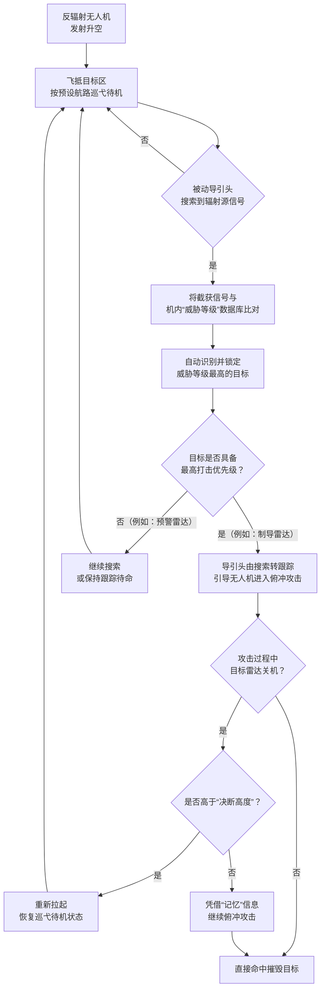
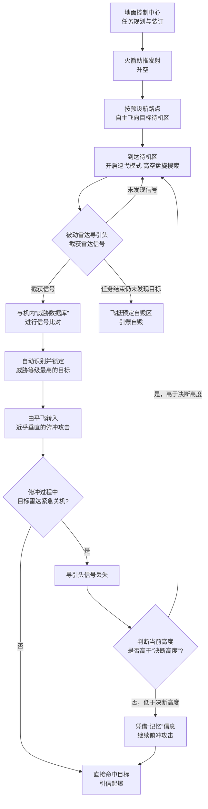

# 打击目标
防辐射无人机的主要打击目标是**各类地面雷达系统**，以及**通信地面站**等其他的电磁辐射源。这类无人机也被称为“雷达杀手”，专门用于压制和摧毁敌方防空系统。
根据搜索结果，其打击目标可以细分为以下几类：

| 目标类别 | 具体目标 | 目标说明 |
| :--- | :--- | :--- |
| **核心目标：地面雷达** | 防空系统的搜索雷达、跟踪雷达、照射雷达 | 这是最主要的打击目标。通过摧毁这些雷达，可以使敌方的防空系统“致盲”，为己方战机开辟安全通道。 |
| **扩展目标：其他辐射源** | 通信地面站、指挥通信体系 | 反辐射无人机同样可以攻击这些持续发射电磁波的目标，破坏敌方的指挥和通信链路。 |
| **潜在目标：海上舰船** | 两栖舰船、航母等水面舰艇 | 舰艇上的对空搜索雷达、火控雷达等也是潜在的攻击对象，理论上可以攻击以舰载雷达为目标的舰船。 |

需要补充的是，反辐射无人机具备以下特点，使其成为这些目标的“克星”：
*   **长航时巡弋**：它可以在目标区域上空长时间（通常超过4小时）盘旋待机。一旦敌方雷达开机，就能迅速发起攻击，这种“守株待兔”的方式对**移动式或间歇性开机的雷达**尤其有效。
*   **复合制导**：现代反辐射无人机不仅装有被动雷达导引头来追踪电磁信号，还集成了光电、红外等制导模式。即使目标雷达在遭受攻击时紧急关机，无人机也能依靠其他模式继续锁定并摧毁目标，抗干扰能力更强。
*   **多种作战模式**：既可以单机出击，也可以采用“蜂群”战术，对敌方的防空系统形成饱和攻击和持续压制。

# 目标打击优先级
为反辐射无人机的打击目标排序，本质上是一个动态的“威胁评估与抉择”过程。这个过程并非简单地在战前列一个固定的清单，而是在实战中，由**预先设定的“威胁等级”参数**与**无人机自身的“自动目标识别”能力**共同完成的 。

下面这张流程图清晰地展示了从升空到完成攻击的整个逻辑：

基于上述逻辑，我们可以将各类打击目标进行一个通常情况下的优先级排序。这个排序主要依据目标对己方空中力量的**即时威胁程度**：

### 🎯 目标打击优先级排序

| 优先级 | 目标类别 | 典型目标 | 战术理由 |
| :--- | :--- | :--- | :--- |
| **第一优先级** | **火控制导雷达** | 地空导弹的**跟踪/照射雷达**、高炮的炮瞄雷达 | 这类雷达直接控制着防空武器，对正在执行任务的己方飞机构成**最直接、最致命的威胁**。优先摧毁它们，可以立刻为后续空中力量“撕开”一道安全缺口。 |
| **第二优先级** | **目标搜索/警戒雷达** | 远程预警雷达、低空补盲雷达 | 它们是防空体系的“眼睛”，负责发现和指引目标。虽然不直接开火，但摧毁它们能让整个防空系统陷入“致盲”状态，为后续大规模空袭创造有利条件 。 |
| **第三优先级** | **指挥通信节点** | 通信地面站、数据链中继站 | 这些目标负责传递指令和协调作战。打击它们可以切断雷达与指挥中心、导弹发射架之间的联系，使敌方防空系统陷入混乱和瘫痪。 |
| **特殊目标** | **高价值机载平台** | 预警机、电子战飞机 | 虽然反辐射无人机主要用于打击地面目标，但理论上可以攻击这些空中辐射源 。一旦得手，对敌方整个作战体系的打击将是毁灭性的，因此一旦出现，会瞬时成为最高优先级。 |

### 💡 实战中的复杂情况

当然，实战中的情况远不止按图索骥这么简单，还有一些关键因素会影响最终的排序和打击决策：

*   **目标“狡猾”关机**：这是最常见的情况。如果无人机在俯冲攻击时目标雷达突然关机，信号消失，飞控系统会根据当前高度做出判断 ：
    *   如果高于“决断高度”，无人机会放弃攻击，重新拉起，继续在目标区上空巡弋，等待目标再次开机。
    *   如果低于“决断高度”，来不及拉起，无人机会凭借“记忆”中的目标位置信息，继续俯冲攻击。
*   **存在虚假“诱饵”**：敌方可能会部署假雷达或辐射源，引诱反辐射无人机攻击。这就需要无人机具备更强的信号识别能力，或与侦察系统配合，辨别真伪 。
*   **辐射源类型变化**：随着技术发展，打击目标也在扩展。除了传统的地面雷达，一些反辐射无人机也开始具备攻击**干扰源、通信节点**甚至**预警机**的能力 。这意味着目标库在不断扩大，威胁等级的判断也需要随之更新。

这个排序过程充分体现了反辐射无人机“发射后不管”和“智能化”的特点。它们不再是简单的飞行炸弹，而是能在复杂电磁环境中自主“狩猎”的智能武器。如果想了解某个特定型号（比如以色列的“哈比”）的具体排序逻辑，我们可以再深入探讨 。

# 哈比无人机
以色列“哈比”无人机的系统完成逻辑，可以看作一个经典的“发射后不管”的自主攻击流程。它就像一个在高空盘旋、耐心“狩猎”雷达信号的智能杀手，其核心逻辑与我们之前讨论的目标排序原则高度一致。

下面这个流程图清晰地展示了它从发射到命中或自毁的完整任务周期：

### 🎯 “哈比”的自主攻击逻辑详解

这个流程体现了哈比无人机几个关键的设计思想和作战步骤：

1.  **任务规划与发射**：作战前，地面控制中心会根据情报，为每一架“哈比”规划好飞行路径和待机区域，并将这些数据和内置的**“威胁数据库”**（包含已知敌方雷达的信号特征）一起装订到无人机上。随后，无人机通过火箭助推从发射箱升空。

2.  **巡弋待机与搜索**：无人机按照预设航路，自主飞行到目标区域上空，然后开启长时间（可达6小时或更久）的巡弋模式。在这个阶段，它主要依靠**被动雷达导引头**静静搜索周围的电磁信号，自身不辐射电磁波，因此很难被敌方发现。

3.  **智能识别与目标排序**：这是其完成“目标排序”的核心环节。
    *   **信号捕获与比对**：一旦导引头截获到雷达信号，机载计算机便会立即将其与内置的“威胁数据库”进行比对。
    *   **威胁等级判定**：系统会根据预设的算法，自动识别出最具威胁的目标。例如，正在为导弹提供制导的**火控雷达**，其优先级会远高于执行一般警戒任务的**远程预警雷达**。这完全印证了我们上一轮讨论中“优先摧毁对己方构成最直接致命威胁目标”的原则。

4.  **锁定与攻击**：在锁定最高优先级目标后，无人机会从平飞姿态迅速转入**近乎垂直的俯冲**，以最大速度扑向目标，并在目标上空引爆32公斤的高爆战斗部，利用破片和冲击波有效摧毁雷达天线及周边设施。

5.  **应对“雷达关机”**：“哈比”最著名的特点之一就是能有效应对目标雷达的突然关机。
    *   **“决断高度”机制**：如果在俯冲攻击过程中，目标雷达紧急关机，信号消失，“哈比”的飞控计算机会根据当前高度做出判断：
        *   如果高度还比较高（高于“决断高度”），它会认为还有机会，于是**中止攻击，重新拉起**，回到巡弋状态，继续等待目标再次开机。
        *   如果高度已经很低（低于“决断高度”），来不及拉起，它会凭借**“记忆”中最后的目标位置信息**，继续惯性俯冲，完成攻击。
    *   **终极处置**：如果在整个任务周期内都没有发现任何可攻击的目标，或者在燃料耗尽后，“哈比”会按照预设程序，飞抵一个安全的预定区域上空**自行引爆**，以防止技术落入敌手。

### 💡 总结

总的来说，“哈比”无人机的系统逻辑是一个由**数据支持（威胁数据库）、传感器引导（被动雷达）、决策核心（机载计算机）**构成的闭环。它通过“先数据库比对排序、后自主抉择攻击”的方式，实现了对敌方雷达“雷达开机即面临被摧毁风险”的强大威慑，是防空压制任务中一种高效且致命的武器。

这个逻辑是哈比这类早期型号的代表。后续的“哈洛普”等型号则增加了“人在回路”的控制方式，你想了解一下这种升级带来的变化吗？

# 哈洛普
从“哈比”到“哈洛普”的升级，最核心的变化就是引入了**“人在回路”**的控制方式。这相当于给这位原本完全自主的“雷达杀手”配备了一位可以远程指导的“战场指挥官”，让它在保持原有优势的同时，作战方式变得更加灵活和智能。

为了让你更直观地理解这种升级，我把“哈比”和“哈洛普”的核心区别整理成了一个对比表格：

### ⚔️ “哈洛普” vs. “哈比”：核心升级对比

| 对比维度      | **“哈比”无人机 (Harpy)**                     | **“哈洛普”无人机 (Harop)**                                  | **升级带来的战术优势**                               |
| :-------- | :-------------------------------------- | :---------------------------------------------------- | :------------------------------------------ |
| **控制方式**  | **完全自主** 发射后完全依靠内置程序自动搜索和攻击，无法中途干预。  | **“人在回路”+自主** 可通过双向数据链，由地面操作员实时控制和监督。              | **决策更灵活**：操作员能根据实时战况做出最优判断，减少误伤，应对复杂局面。     |
| **目标范围**  | **单一** 主要打击预先设定的雷达等电磁辐射源。            | **多元** 除雷达外，可通过光电传感器打击任何可视的高价值目标，如指挥所、车辆、舰船等。      | **任务更多样**：从专职的“雷达杀手”升级为多面手，可执行侦察、打击等多种任务。   |
| **回收能力**  | **不可回收** 任务结束未发现目标则自毁。               | **可回收** 若未收到攻击指令且目标未出现，可自行返航回收，重复使用。               | **效费比更高**：避免了资源浪费，降低了单次任务的成本。               |
| **抗关机策略** | **被动“记忆”攻击** 低于“决断高度”时，仅靠最后位置信息惯性攻击。 | **主动“中止”攻击** 攻击过程中若目标关机或发现是错误目标，可在高空直接取消攻击，重新爬升待机。 | **打击更精准**：能有效应对雷达关机战术，避免被诱骗，提高了打击的成功率和生存能力。 |

### 💡 “人在回路”的具体体现

“哈洛普”增加的“人在回路”功能，并不是简单地用遥控器去飞一架无人机，而是在关键节点上引入了人的智慧，主要体现在以下几个场景：

1.  **巡弋侦察，操作员介入识别**：“哈洛普”在目标区上空巡弋时，其机载光电传感器会将实时画面通过数据链传回地面控制站。操作员可以清晰地看到地面情况，如果发现一个原本设定为打击目标的雷达没有开机，但旁边有一个临时集结的坦克车队，操作员可以直接命令“哈洛普”放弃等待，转而攻击这个更具时效性的高价值目标。

2.  **攻击确认与中止**：这是“人在回路”最具价值的一点。在“哈洛普”俯冲攻击的最后阶段，操作员可以亲眼见证攻击过程。如果发现目标周围有己方部队或平民，或者目标突然移动到了不适合攻击的位置，操作员可以在最后一刻通过指令中止攻击。无人机随后会放弃俯冲，重新拉起爬升，回到巡弋状态，等待下一次指令。这极大地避免了附带损伤。

3.  **对付“静默”目标**：“哈比”只能攻击开机的雷达。而“哈洛普”依靠操作员的介入，可以攻击始终保持无线电静默的目标。例如，操作员通过光电画面发现了一个隐蔽的指挥所，就可以直接引导“哈洛普”对其进行“自杀式”撞击，这是“哈比”无法完成的任务。

### 🎯 总结

总的来说，“哈洛普”在保留了“哈比”核心的反辐射能力和长航时优势基础上，通过增加“人在回路”控制，**将机器的自主、高效与人的判断、灵活完美结合**。它不再是一个只能按程序行事的“杀手”，而变成了一个能侦察、会思考、可选择的“空中猎手”。这使其在现代复杂战场环境下的适用性和生存能力都得到了显著提升。

表格里提到了“哈洛普”在纳卡冲突中的实战表现，想了解它在真实战场上具体是怎么应用的吗？或者我们也可以聊聊，这种“人在回路”的方式会带来哪些新的挑战。

# 纳卡冲突中的哈洛普
“哈洛普”在纳卡冲突中的表现，堪称实战中教科书级的“防空压制”案例。它完美展现了我们之前讨论的那些特性：**“人在回路”的灵活、打击非辐射源目标的多样性，以及与僚机协同的战术智慧**。

下面这个表格汇总了它在冲突期间的主要战绩：

| 打击目标 | 目标类型 | 战果与意义 | 数据来源 |
| :--- | :--- | :--- | :--- |
| **S-300PS远程防空系统** | 核心防空节点 | 摧毁**导弹发射车**，打破了俄制先进防空系统不可战胜的神话，展示了反辐射打击的有效性。 |  |
| **“驱虫剂-1”反无人机系统** | 电子战/软杀伤节点 | 摧毁专门反制无人机的电子战系统，**“以子之矛，攻子之盾”**，被评价为“世界首次”对干扰系统的反辐射攻击。 |  |
| **2S3型自行火炮、防空阵地** | 地面战术目标 | 在**2016年“四日战争”**期间，对非辐射目标实施**6次精确打击**，证明其多用途能力。 |  |
| **巴士（非战斗人员）** | 附带损伤案例 | 2016年攻击运送志愿者的巴士造成伤亡，这一事件引发了对自主武器伦理风险的讨论。 |  |

### 💡 核心优势在实战中的体现

“哈洛普”之所以能取得这些战果，关键在于它将自身的性能优势与巧妙的战术完美结合。

*   **“人在回路”的终极考验**：“哈洛普”攻击S-300的过程，是“人在回路”价值的完美体现。面对S-300这种高价值目标，阿军操作员并未完全依赖其自主模式，而是很可能**通过数据链实时接收“哈洛普”传回的光电画面，在最后时刻人工确认了目标（如发射车）并下达了攻击指令**。这确保了打击的精准，避免了误伤。而当攻击“驱虫剂-1”系统时，这套逻辑也适用：操作员利用其被动探测能力发现并锁定这个专门反制无人机的“硬骨头”，一击必杀。

*   **“高低搭配”的战术组合**：“哈洛普”的成功并非孤军奋战，而是融入了一套精妙的战术体系。阿军常使用改装的**安-2无人机作为廉价诱饵**，引诱亚美尼亚的防空雷达开机。就在雷达开机的瞬间，在高空巡弋的“哈洛普”便能迅速锁定并扑向目标，而紧随其后的**TB-2察打一体无人机**，则可以趁虚而入，清扫残余或攻击其他暴露的地面目标。这套“诱饵探测-反辐射打击-察打一体清扫”的组合拳，让亚美尼亚的防空体系防不胜防。

*   **网络舆论战的放大器**：此外，“哈洛普”的机载光电系统拍摄的打击画面，也被阿军广泛用于网络舆论战。这些极具冲击力的第一视角打击视频被传到网上，极大地打击了亚美尼亚的士气和国际形象，同时也为“哈洛普”和TB-2做了一次效果极佳的实战广告。

### ⚔️ 矛与盾的较量：亚美尼亚的反制与教训

面对“哈洛普”的威胁，亚美尼亚并非毫无还手之力，但其反制措施总体效果有限，也暴露了不少问题。

*   **有限的成功反制**：亚美尼亚军队使用**9K333“柳树”单兵肩扛式防空导弹**，成功击落过一架“哈洛普”。这说明即使是低空慢速的小型目标，传统的防空火力依然有机会，但其效费比很低。
*   **体系失效的根源**：亚军失败的根本原因在于其防空体系存在代差和漏洞。其主力S-300等俄制防空系统主要针对有人战机和弹道导弹，对“哈洛普”这类雷达反射截面小、飞行模式特殊的低速目标探测能力不足。同时，各防空单位之间**各自为战，缺乏统一的指挥和信息共享**，无法形成合力。在战术上，亚军也未能及时针对“哈洛普”的光电制导特点，对重要目标采取**施放烟幕、伪装网等有效的被动防御措施**。

纳卡冲突为“哈洛普”这类武器提供了一个近乎完美的实战舞台。它证明了在体系支撑下，即使是性能不算最顶尖的无人机，也能通过灵活战术摧毁价值远超自身的对手，彻底改变了现代战争的游戏规则。

我们刚聊完“哈洛普”的辉煌战果，你想不想听听亚美尼亚军队在吸取这些教训后，可能会在未来的反无人机作战中采取哪些新对策？或者我们也可以探讨一下，面对这样的威胁，现代地面部队该如何伪装和生存？

# 人在回路
引入“人在回路”虽然赋予了“哈洛普”这类无人机极大的战术灵活性，但同时也带来了一系列新的、甚至更为复杂的挑战。这些挑战不仅存在于技术层面，更深刻地影响着作战的伦理、法律和心理学维度。

我们可以从以下几个层面来理解这些挑战：

### 📡 技术层面的挑战：脆弱的数据链

“人在回路”的核心是地面操作员与无人机之间的实时数据链接。这条看不见的线，既是无人机的“生命线”，也是它最脆弱的“阿喀琉斯之踵”。

1.  **链路中断与失控**：在高强度的对抗环境中，数据链极易受到干扰、阻塞甚至被敌方欺骗。一旦链路中断，操作员就会“失明”和“失聪”，无法接收关键的目标画面，也无法下达中止或攻击的指令。此时，无人机虽然可能具备一定的自主模式（如爬升到安全高度等待指令或按预设程序返航），但在瞬息万变的战场上，这种“失控”状态可能导致错过最佳攻击时机，甚至在需要紧急中止攻击以避免误伤时无法执行指令。

2.  **带宽与延迟的困扰**：传输高清的光电/红外视频画面需要极大的带宽。在多架无人机同时执行任务的“蜂群”作战场景下，带宽资源的分配会成为巨大的技术瓶颈。此外，卫星通信或远距离传输必然带来一定的信号延迟。对于高速俯冲攻击的无人机来说，哪怕只是几秒钟的延迟，也可能导致操作员看到的是过时的画面，从而做出错误的决策。

### 🧠 人的因素层面的挑战：认知负荷与决策压力

将人置于回路中，意味着人的认知和生理极限成为了作战链条中的一部分。

1.  **巨大的认知负荷**：操作员不仅要同时监控无人机的状态、目标的画面、周边的战场环境，还要时刻保持与指挥中心的通讯。长时间的精神高度集中极易导致疲劳、注意力下降，甚至出现“隧道视野”（只关注眼前目标而忽略全局风险）。在一次纳卡冲突的误伤平民事件（攻击巴士）中，操作员的误判或决策压力就被认为是可能的原因之一。

2.  **“远程杀戮”的心理影响**：关于操作员是否会因身处千里之外而产生心理隔阂，进而更轻易地发动攻击，学界一直有争论。虽然有研究表明，通过高清画面目睹爆炸和人员伤亡，同样会给操作员带来创伤后应激障碍，但这种“游戏化”的操作界面和物理距离，至少在理论上降低了发动攻击的心理门槛，可能影响其决策的谨慎性。

3.  **决断的“生死时速”**：当无人机在高空巡弋时，操作员有充足的时间思考。但当它进入俯冲攻击的最后阶段，留给操作员判断和决策的时间可能只有几十秒甚至几秒。在这种极端的时间压力下，要求操作员精准地识别目标性质、评估附带损伤风险并做出最终决断，无疑是一个极其严苛的挑战。

### ⚖️ 伦理与法律层面的挑战：责任的归属

当拥有“人在回路”的自主武器系统造成误伤时，谁该为此负责？这个问题至今没有明确的国际法共识。

1.  **责任主体的模糊性**：
    *   是下达攻击指令的**操作员**吗？但他是在基于无人机传回的不完整或具有延迟性的信息做出的判断。
    *   是设计、制造并设定了系统参数的**制造商和程序员**吗？但他们的产品在作战中的具体使用方式是他们无法控制的。
    *   是批准此次作战任务的**指挥官**吗？他可能并不掌握此次攻击的所有微观细节。
    *   这种责任的分散和模糊，可能导致“责任黑洞”，使得受害者难以追究任何一方的责任。

2.  **交战规则的挑战**：如何将复杂的国际人道法（如区分原则、 proportionality 比例性原则）转化为机器和操作员可以执行的指令？例如，如何让一个身处后方的操作员，仅凭一个无人机视角的画面，就准确判断出目标建筑物内是否有平民、其军事价值是否值得冒这个风险？这给现代战争的交战规则制定和执行带来了前所未有的挑战。

### 💡 战术对抗层面的挑战：新的欺骗与反制手段

“人在回路”的特性也为对手提供了新的攻击维度。

1.  **针对操作员的欺骗**：对手可以利用虚假的电子信号或精心布置的假目标（如充气坦克、假雷达），诱骗操作员发动攻击，从而浪费宝贵的弹药和时间，甚至暴露己方的攻击意图和位置。高水平的欺骗，甚至可以影响操作员的心理判断。

2.  **网络攻击与“反客为主”**：理论上，如果能够入侵数据链，对手不仅可能窃取情报，甚至可能发送虚假的遥测数据或指令，误导无人机飞向错误目标、中止对己方有利的攻击，或者诱使其坠毁。

总的来说，“人在回路”的设计初衷是将机器的精确与人的智慧相结合，以弥补完全自主系统的不足。但它同时也将人的弱点、技术的瓶颈和复杂的伦理问题引入了作战体系。未来的战争，不仅考验武器的性能，更考验如何在这套复杂的人机系统中，有效管理这些新挑战。

如果想了解更多关于如何应对这些挑战（例如更安全的通信技术、操作员训练等），我们可以继续探讨。

# JWS-01
以国产JWS-01反辐射无人机为例，其“任务规划与发射”环节，是连接战前决策与实战执行的起点，体现了其作为“雷达杀手”的典型作战流程。

JWS-01在执行任务前，会经历一个清晰的准备与发射流程。整个过程可以概括为以下两个核心步骤：

接下来，我们来详细拆解这两个步骤，看看JWS-01是如何从一辆发射车，变成空中猎手的。

### 🗺️ 第一步：任务规划与准备

这是整个作战链条的起点，所有后续的自主行动都基于此阶段的设定。

-   **作战目标与航路规划**：在发起攻击前，地面控制车（整个系统的基本火力单元通常包括**1辆地面控制车、3辆发射车**和辅助设备）内的操作员，会根据侦察情报和上级指令，确定本次任务的目标区域。随后，会为每一架即将发射的JWS-01规划好**从发射点到目标待机区的飞行路径**。这一步相当于给无人机下达了一份“路线图”。

-   **数据装订与系统检查**：规划的飞行路径，连同内置的**“威胁数据库”**（包含了敌方各类雷达的信号特征，如频率2-16GHz ），都会被装订到JWS-01的机载计算机中。这个数据库至关重要，它是无人机未来在空中自主搜索、识别和排序打击目标的依据。在装订数据的同时，地面人员会完成对无人机和发射系统的最后检查，确保一切就绪。

### 🚀 第二步：发射升空

准备工作完成后，就进入了激动人心的发射环节。

-   **火箭助推发射**：JWS-01采用**固体火箭助推器**进行零长发射。它被封装在车载的六联装发射箱内。一辆发射车通常为**6×6卡车底盘，携带6个发射箱，按两层三排布置**，每个箱内装有一架无人机，全车共6架。接到发射指令后，助推火箭点火，将无人机从发射箱内高速弹出，迅速获得初速和高度。

-   **展开弹翼与发动机启动**：在飞离发射箱后，JWS-01的折叠弹翼会自动展开。同时，其搭载的**小型活塞发动机**（使用普通车用或航空汽油 ）启动，为后续的长航时巡航提供动力。至此，发射阶段完成，JWS-01正式踏上征程，它将沿预设航路飞向数百公里外的目标区域，开启长达**4小时**的空中巡弋，静待敌方雷达开机。

### 💡 技术演进与实战意义

值得一提的是，JWS-01的这种发射方式也带来一个战术上的双刃剑：**火箭助推会产生明显的烟雾和火光，容易暴露发射阵地**。这也是为什么相关分析认为，中国可能正在逐步淘汰这种传统的火箭发射方式，转而研发更隐蔽的**空压或活塞发射技术**，以提升发射单元的生存能力。

此外，JWS-01主要依赖预设程序和被动雷达寻的进行自主攻击，可以看作是**早期“哈比”的国产化版本**，并未像后续的“哈洛普”那样普遍加装光电设备。因此，它的“人在回路”能力相对有限，更多地是依靠“发射后不管”的自主作战模式。而其外贸型ASN-301，则提及了可以结合远程控制完成目标选择，展现了更灵活的技术发展路径。

JWS-01的这套“任务规划与发射”流程，体现了反辐射无人机“**待机时间长、自主智能、使用灵活**”的核心设计思想。通过将作战方案转化为机器指令，并用可靠的发射方式将其送入战场，这套系统实现了对敌方雷达从发现到摧毁的完整杀伤链。

# **自毁**
根据目前公开的资料，你提到的JWS-01反辐射无人机，**本身并不具备自主回收的能力**。如果它在整个任务周期内都没有攻击目标，最终的结局是**自毁**。

这背后的原因，与其设计定位息息相关。我们可以从以下几个维度来理解JWS-01在未击中目标后的处理逻辑：

| 问题维度 | 具体解答 | 依据与说明 |
| :--- | :--- | :--- |
| **能否自主回收？** | **不能**。JWS-01被设计为一种“自杀式”或“巡弋攻击”无人机，属于一次性使用的弹药。它的起落架、飞行控制系统等，都没有为安全的自主着陆或回收进行设计。 | 从其火箭助推发射、搭载高爆战斗部的基本特征，可以明确其“有去无回”的属性。 |
| **未击中目标后的处理流程** | **按预设程序自毁**。虽然没有找到JWS-01的官方手册，但基于其原型“哈比”及同类反辐射无人机的通用逻辑，流程通常是： 1. **持续搜索**：在目标区上空按预设航线巡弋，被动搜索雷达信号，续航时间约4小时。 2. **燃料耗尽**：当燃油即将耗尽，仍无攻击机会。 3. **执行自毁**：无人机将根据预设指令，飞向一个安全的、预先设定的自毁区，或在无法返航时直接在空中引爆，以防止技术落入敌手。 | JWS-01的国产化改进主要在航程、杀伤力等性能上，并未像以色列后来的“哈洛普”那样增加“人在回路”的可回收功能。有资料提及它可以“返回基地”，但这一说法与它作为自杀式攻击无人机的基本特征存在矛盾，很可能指的是它可以飞回预设的自毁区或改变攻击目标。 |
| **为什么这么设计？** | 这是由其**作战任务和效费比**决定的： 1. **任务单一**：JWS-01是专职的“雷达杀手”，旨在压制和摧毁敌方防空系统。它追求的是在目标上空长时间待命，抓住战机“一击必杀”，而不是重复使用。 2. **成本考量**：作为一种携带战斗部的巡航弹药，其机体结构本就相对简单。为了实现回收，需要增加精密的导航、着陆系统和坚固的起落架，这会大大增加成本和系统复杂度，得不偿失。 | 正因如此，它的单机造价被控制在约30万美元，远低于可回收的察打一体无人机。 |

### 💡 总结与延伸

简单来说，JWS-01是一个“**空中智能弹药**”。它的使命就是被发射出去，在空中耐心等待，要么摧毁目标，要么在任务结束后通过自毁“保密”。这是一种典型的、为高强度防空压制任务而优化的设计思路，体现了“发射后不管”和追求极限效费比的战术思想。

我们之前讨论过的“哈洛普”，正是在JWS-01/Harpy的基础上，通过增加“人在回路”和数据链，才实现了可回收、可重复使用的能力。

