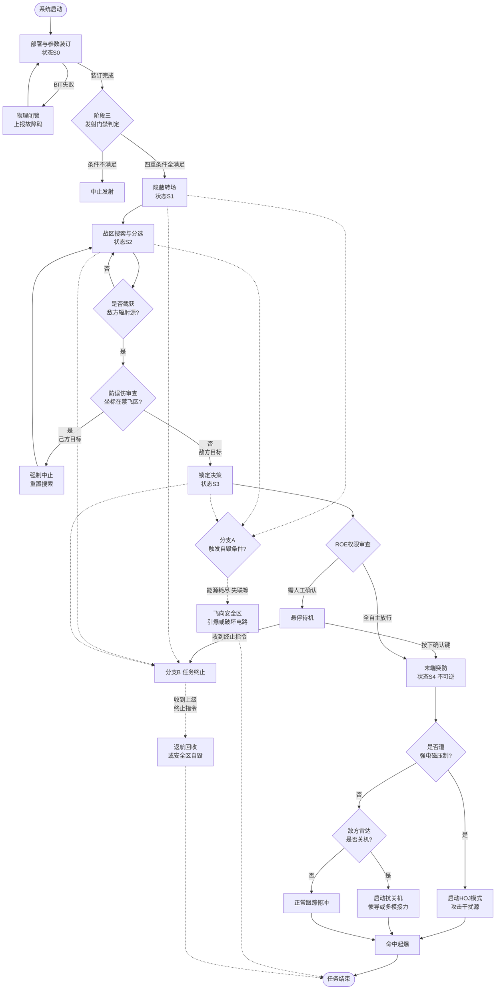

**文档版本：** V1.0
**适用对象：** JWS01反辐射无人机系统
**核心定位：** 防空压制（SEAD）与精确打击

---
# 系统组成

JWS01并非单架飞行器，而是一个完整的“侦察-打击-评估”武器系统。系统主要由**无人机平台、任务载荷、地面控制与保障系统**三大分系统构成。

## 1. 无人机平台分系统 (空中部分)
*   **机身与结构：** 采用隐身外形设计（多面体或飞翼布局），机体材料选用透波复合材料（如玻璃纤维/碳纤维混编），以降低雷达散射截面积（RCS），减少被敌方防空系统发现的概率。
*   **动力系统：** 通常采用小型涡喷发动机或高效活塞发动机（提供长航时），配备螺旋桨或推进式涵道风扇。具备在复杂气象条件下的稳定工作能力。
*   **飞行控制与导航系统：**
    *   **飞控计算机：** 无人机的大脑，负责全姿态控制、航路跟踪、自动起降控制。
    *   **导航模块：** 惯性导航系统（INS）与北斗/GPS多模卫星导航系统（GNSS）深度耦合，可选配地形跟随（TF）雷达或激光高度计，支持低空超低空突防。

## 2. 任务载荷分系统 (核心杀伤链)
*   **宽带被动雷达导引头 (PRH)：** 核心传感器。覆盖典型的L、S、C、X等防空雷达频段。具备高灵敏度、高测向精度（DOA）和强大的信号分选能力，能在高密度电磁环境中精准锁定目标雷达。
*   **多模末制导单元（可选配置）：** 针对敌方雷达“关机”策略，可加装微型毫米波雷达或红外成像导引头，实现“辐射源丢失后的视觉/雷达寻的”。
*   **战斗部与引信：**
    *   **战斗部：** 采用破片杀伤战斗部或聚能破甲战斗部（针对雷达天线罩或方舱），配备预制破片，确保有效摧毁半径。
    *   **引信：** 复合引信（激光近炸引信 + 触发引信），确保在最佳高度/角度起爆。
*   **数据链终端：** 包含宽频加密数据链电台，用于上行接收指令、下行回传状态和遥测数据，支持无线电静默模式。

## 3. 地面控制与保障分系统 (地面部分)
*   **指挥控制方舱 (GCS)：** 集成任务规划工作站、综合显控台、态势感知屏幕。操作手在此进行任务解析、航路规划、参数装订及发射控制。
*   **发射单元：** 多联装发射车（箱式或导轨式），具备快速起竖、发射功能，支持单车多发齐射，形成饱和压制能力。
*   **检测与装订设备：** 地面便携式测试仪，用于发射前的全面BIT（机内测试）检测，以及通过有线方式向飞控和导引头高速注入目标库和航路数据。
*   **后勤保障设备：** 包含电源车、加注设备、无人机体储存箱、运弹车等。

---

# 运行流程

## 1. 阶段一：无人机部署

本阶段为物理层面的准备与系统唤醒，由基层操作人员完成。

*   **1.1 运输与展开：** 将JWS01无人机由储存箱/发射车取出，安装至发射导轨或发射箱内。
*   **1.2 物理连接：** 连接地面检测设备、数据加载线缆及供气/供电测试接口。
*   **1.3 系统自检 (BIT)：**
    *   飞控系统自检（舵机、IMU、高度计）。
    *   动力系统自检（发动机/电动机点火电路、燃油/电量余量）。
    *   引信与战斗部检测（安全保险状态确认）。
    *   **载荷自检（核心）：** 宽带被动雷达侦察导引头（PRH）灵敏度与频段覆盖测试。
    *   *异常处理：若自检未通过，系统将物理闭锁发射电路，并向地面控制站（GCS）上报具体故障码，禁止带病作业。*
*   **1.4 状态上报：** 自检通过后，无人机向地面控制站（GCS）上报“ readiness ”（就绪）状态，进入待命行列。

## 2. 阶段二：接收上级任务

本阶段为战术指挥链条的信息下达过程，通常由营/旅级指挥所发起。

*   **2.1 任务下达：** 上级指挥系统通过数据链（无线宽带或光纤）向GCS下发任务指令。
*   **2.2 任务要素解析：** GCS解析任务报文，提取核心要素：
    *   **任务类型：** 压制性巡飞（待机寻歼）、定点清除（已知坐标打击）、随遇打击（发现即摧毁）。
    *   **目标特征：** 敌方雷达型号、工作频段、脉冲重复频率（PRF）、大致坐标范围。
    *   **时间窗口：** 起飞时间、巡飞时间限制、最终打击截止时间。
*   **2.3 任务确认：** 操作手在GCS上核对任务信息，点击“确认接收”，系统锁定任务。

## 3. 阶段三：任务设置与参数装订

本阶段是将战术意图转化为无人机可执行的机器代码的过程。

*   **3.1 航路规划与安全边界装订：**
    *   装订初始转向点（WPT）、巡航航路点及进入目标的航路角（结合地形匹配突防）。
    *   **强制划定电子禁飞区（白名单）：** 注入己方阵地及友邻部队坐标，作为后续防误伤的绝对红线。
*   **3.2 目标库与辐射源参数装订：**
    *   将敌方雷达的“指纹”数据（威胁等级优先级排序：预警雷达 > 引导雷达 > 炮瞄雷达）写入导引头。
    *   设定“辐射源容限阈值”（如：信号强度达到多少dBm才确认为真目标，过滤背景电磁干扰）。
*   **3.3 飞行参数装订：**
    *   巡航高度、巡航速度。
    *   搜索航线参数（如：椭圆盘旋、八字形、矩形扫描）。
*   **3.4 交战规则 (ROE) 设定：**
    *   **模式A（严格授权）：** 仅打击预先装订的特定频段/型号雷达。
    *   **模式B（泛化压制）：** 打击搜索区内任何开启的敌方防空雷达（优先级最高者）。
*   **3.5 参数固化与断开：** 参数写入机载飞控计算机与导引头非易失性存储器，拔除物理连接线缆，无人机转为“机载自主供电”状态。

## 4. 阶段四：发射

*   **4.1 发射硬性门禁判定（四重互锁）：** GCS检查必须**同时满足**以下条件，否则点火电路断开：
    1.  INS（惯导）对准完成，GNSS（北斗/GPS）定位授时正常。
    2.  战斗部引信处于绝对安全状态。
    3.  发射坐标未落入装订的“禁飞区”。
    4.  发射区空域清空。
*   **4.2 发射指令：** 操作手按下“发射”按钮（或上级一键统发）。
*   **4.3 动力启动与离轨：** 助推器点火（或气动弹射/抛投），无人机离轨。
*   **4.4 初始姿态建立：** 无人机在0.5~2秒内完成俯仰、偏航、滚转的稳定控制，爬升至预定巡航高度，向第一个航路点切入。
*   **4.5 链路切换：** 若发射时使用短距有线链路，此时自动切换至超短波/卫星数据链，向GCS发送“Launch Success”信号。

## 5. 阶段五：巡航

本阶段强调低损耗、隐蔽性到达预定战区。

*   **5.1 导航飞行：** 依赖“INS+GNSS”耦合导航进行飞行。
*   **5.2 射频静默：** 在飞越敌方防空警戒线前，数据链保持“只听不说”状态，被动雷达导引头处于低功耗休眠状态，降低被敌方电子侦察发现的概率。
*   **5.3 阵位抵近：** 按照装订的航路点飞行，到达“搜索起始点”。

## 6. 阶段六：搜索

到达战区后，JWS01进入核心的“猎杀”状态。

*   **6.1 开启搜索：** 飞至预定盘旋区域，按照设定的搜索航线（如“8”字形）飞行，被动雷达导引头全功率开机。
*   **6.2 电磁环境感知：** 导引头快速扫描预设频段，截获空间中的电磁脉冲信号。
*   **6.3 信号分选与识别：**
    *   对截获的信号进行去交错、分选。
    *   提取参数：载频（RF）、脉宽（PW）、重频（PRF）、到达角（DOA）。
    *   **比对目标库：** 与装订的威胁库进行比对，确认是否为敌方雷达。
*   **6.4 虚警剔除：** 结合多次扫描结果，剔除己方干扰机信号、民用电磁信号及反射波。
*   **6.5 防误伤审查（核心逻辑）：** 即便信号匹配敌方雷达，系统必须利用DOA实时解算辐射源坐标。**若坐标落入己方“电子禁飞区/白名单”，则强制判定为误目标，立即中止锁定。**
*   **6.6 目标锁定：** 确认为真实高价值敌方目标且通过防误伤审查后，导引头由“搜索状态”转入“单脉冲跟踪/相位干涉仪测向状态”，实时输出目标视线角（LOS），飞控系统开始计算打击航迹。

## 7. 阶段七：末端决策与执行

根据搜索结果和交战规则，JWS01将进入以下三种逻辑分支之一：

### 分支A：正常打击
*   **触发条件：** 识别到符合ROE的敌方辐射源，且目标未在禁飞区内。
*   **俯冲拉起：** 无人机根据导引头提供的视线角，调整航向对准目标。对于顶部攻击型反辐射无人机，通常会先俯冲加速，然后在目标上方拉起，进入大角度俯冲。
*   **抗关机处理：** 若在俯冲过程中敌方雷达突然关机，JWS01启动**抗关机逻辑**（记忆外推航迹 + GPS/INS惯导继续攻击预设坐标；或开启毫米波/红外末制导备份）。
*   **引信解保：** 距目标设定距离（或高度）时，解除战斗部引信安全保险。
*   **命中起爆：** 撞击目标雷达天线或掩体，近炸/触发引信起爆，摧毁目标。无人机向GCS回传最后坐标及“Target Destroyed”信号后，生命终结。

### 分支B：自毁
*   **触发条件（满足任一即触发）：**
    1.  **燃油/电量耗尽**达到安全返航阈值以下，且未发现目标。
    2.  **飞出任务边界**（如偏航超出预定巡飞区特定距离）。
    3.  **导航失效**（INS严重漂移且GNSS长时间失锁，无法维持飞行）。
    4.  **遭到不可逆损伤**（如被防空火力击中主翼，姿态失控）。
    5.  **超时未果**（达到装订的最大巡飞时间限制）。
*   **自毁逻辑：** 飞控切断发动机动力，选择无人区/海域/预设安全坠毁区，启动空中爆破程序（引爆战斗部）或触地引爆，**绝对避免整机及核心技术被敌方完整缴获**。

### 分支C：终止打击
*   **触发条件（满足任一即触发）：**
    1.  **上级干预：** 战场态势突变（如己方部队已推进至该区域，或敌方已投降），GCS下发“任务终止”或“返航”指令。
    2.  **目标属性变更：** 导引头识别到辐射源来自己方雷达（落入装订的禁飞区/安全区白名单）。
    3.  **打击中途指令取消：** 在俯冲阶段前，接收到“终止打击”指令。
*   **终止逻辑（视无人机设计而定）：**
    *   *方案1（具备回收能力）：* 切断战斗部电源（双保险断电），爬升脱离战区，按预设返航航线降落（伞降或滑翔着陆）。
    *   *方案2（一次性消耗品）：* 终止攻击姿态，爬升至安全高度，关闭导引头，执行**安全区程序自毁**（同分支B，但不含战斗部引爆，仅破坏飞控电路）。

---

## 附录：异常处理与抗干扰逻辑（贯穿全阶段）

*   **GNSS欺诱骗防御：** 巡航中若检测到卫星信号异常（多径效应或电平异常），立即切换至纯INS模式，降低对卫星的依赖，并向GCS报警。
*   **Home-on-Jam（干扰源寻的）：** 在搜索或打击阶段，若遭到敌方宽频电磁压制干扰，导致无法识别具体雷达型号，JWS01可将“最强干扰源”视为最高威胁目标，直接引导无人机顺着干扰波束实施物理摧毁（反辐射无人机的隐藏杀手锏）。
*   **数据链中断：** 飞行途中若与GCS失联，无人机严格按照最后装订的航路和ROE继续执行自主任务，不因失联而悬停或返航，确保SEAD任务的闭环。

---


# 详细逻辑流程图
### 方案一：极简兼容版 Mermaid 流程图



---

### 方案二：纯文本树状逻辑图（100%防乱码）

```text
[系统启动]
  │
  ├─▶ [S0] 部署与参数装订
  │     ├─▶ (BIT失败) ➔ 物理闭锁, 排故
  │     └─▶ (装订完成) ➔ 发射门禁判定 (北斗/惯导/引信/禁飞区)
  │           ├─▶ (不满足) ➔ 【中止发射】
  │           └─▶ (全满足) ➔ [S1] 隐蔽转场
  │                 │
  │                 ├─▶ (后台监控: 能源耗尽/失联/越界) ➔ 【S5分支A: 程序自毁】➔ 结束
  │                 ├─▶ (后台监控: 收到上级终止指令) ➔ 【S5分支B: 任务终止】➔ 结束
  │                 │
  │                 └─▶ 抵达战区 ➔ [S2] 搜索与分选
  │                       │
  │                       ├─▶ (未匹配敌方信号) ➔ 继续搜索 (循环)
  │                       └─▶ (匹配敌方信号) ➔ 【防误伤审查: 坐标是否在己方白名单?】
  │                             ├─▶ (是己方) ➔ 强制中止锁定, 重置搜索
  │                             └─▶ (是敌方) ➔ [S3] 锁定决策
  │                                   │
  │                                   ├─▶ (收到终止指令) ➔ 【S5分支B: 任务终止】
  │                                   ├─▶ (人在回路模式) ➔ 悬停待机 ➔ 人工确认/终止
  │                                   └─▶ (获得开火权限) ➔ [S4] 末端突防 (不可逆)
  │                                         │
  │                                         ├─▶ (遭强电磁压制致盲) ➔ 启动HOJ: 顺干扰波束攻击
  │                                         ├─▶ (敌方雷达突然关机) ➔ 启动抗关机: 惯导外推/多模导引接力
  │                                         └─▶ (正常跟踪) ➔ 俯冲加速
  │                                               │
  │                                               └─▶ 【命中起爆, 回传坐标】➔ [任务结束]
  │
[全局状态 S5 说明]
  ├─ 分支A (程序自毁): 切断动力 ➔ 寻找无人区/海域 ➔ 引爆战斗部或破坏核心电路
  └─ 分支B (任务终止): 终止攻击姿态 ➔ 可回收型返航 / 消耗品飞至安全区自毁(不引爆战斗部)
```

### 附：纯文本版流程结构（防图形无法渲染）

*   **【启动与准备】**
    *   系统部署 -> 系统自检(BIT)
    *   *自检失败？-> 返回故障排查。*
    *   *自检成功？-> 接收上级任务。*
*   **【装订与发射】**
    *   任务参数装订（航路、目标库、交战规则）-> 发射起飞 -> 巡航飞行。
*   **【战区搜索循环】**
    *   到达战区，导引头开机搜索。
    *   *判断1：是否发现敌方辐射源？*
        *   **否** -> *判断2：是否异常（无油/失联/超时）？*
            *   是异常 -> **【分支B：自毁】**（空中/触地引爆防泄密）-> 结束。
            *   无异常 -> 继续搜索（回到“到达战区”）。
        *   **是** -> *判断3：是否为己方目标（落入白名单/禁飞区）？*
            *   **是己方** -> **【分支C：终止打击】**（规避并重置搜索）-> 继续搜索。
            *   **是敌方** -> 锁定目标，计算攻击航路。
*   **【末端打击执行】**
    *   *（注：此阶段若接收到上级“终止任务”指令，直接转入【分支C：终止打击/返航/安全自毁】）*
    *   进入俯冲打击。
    *   *判断4：是否被敌方强电磁干扰致盲？*
        *   **是** -> 启动HOJ模式（顺着干扰波束攻击干扰源）-> 命中起爆 -> 结束。
        *   **否** -> *判断5：敌方雷达是否关机？*
            *   **是** -> 启动抗关机逻辑（纯惯导/多模导引记忆攻击）-> 命中起爆 -> 结束。
            *   **否** -> 正常跟踪 -> 命中起爆 -> 结束。