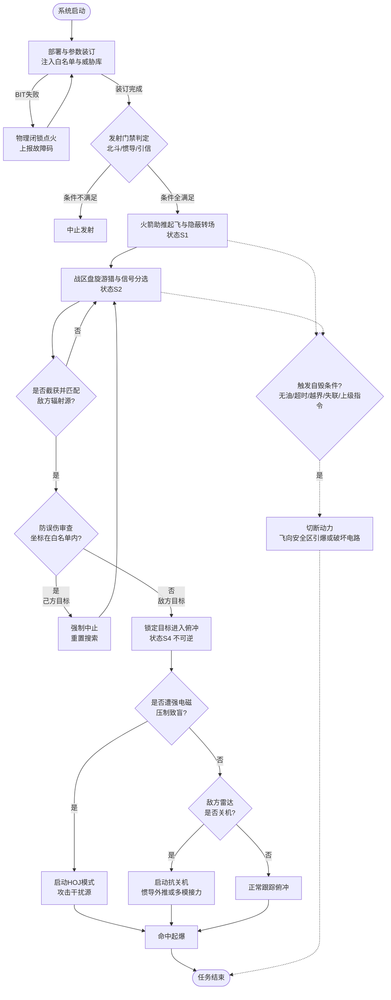

基于“JWS-01是哈比反辐射无人机的自用升级版”这一核心背景，其本质是一种**“发射后不管、自主游猎、一次性消耗”**的防压制武器。原文本中带有较强外贸色彩的“人在回路（人工确认开火）”、“可选多模导引头”、“GPS/北斗双模”、“返航回收”等设定严重偏离了哈比的基本运行逻辑。

我已为您剔除这些不合时宜的设定，还原并优化了其最核心的**“火箭助推起飞 -> 战区盘旋游猎 -> 发现即俯冲 - 单向可控自毁”**的真实战术流程，并对流程图进行了同步重构。

---

# 运行流程

## 1. 阶段一：阵地部署与系统唤醒

本阶段为物理层面的准备，依托储运发一体化的发射箱/车完成。

*   **1.1 箱体起竖与连接：** 发射车抵达发射阵地，将多联装发射箱起竖至设定射角，连接地面检测设备、数据加载线缆及供气/供电接口。
*   **1.2 系统级自检 (BIT)：** 飞控、动力、引信、宽带被动雷达导引头（PRH）依次上电自检。
    *   *异常处理：若自检未通过，系统物理闭锁该发射箱位的点火电路，并向地面控制站（GCS）上报具体故障码，其余箱位不受影响。*
*   **1.3 状态上报：** 自检通过后，无人机向GCS上报“就绪”状态。

## 2. 阶段二：任务解析与参数装订

本阶段将上级战术意图转化为无人机可执行的“底层代码与安全边界”。

*   **2.1 任务要素解析：** GCS接收上级（营/旅级）指令，提取核心要素：战区中心坐标、巡飞时间限制、敌方雷达威胁库（含频段、脉宽、重频等“指纹”数据）。
*   **2.2 航路与白名单装订（核心安全机制）：**
    *   装订从发射阵位到战区巡逻空域的隐蔽突防航路点。
    *   **强制注入己方阵地及友邻部队坐标（电子白名单）**，作为后续防误伤的绝对地理红线。
*   **2.3 巡飞参数与交战逻辑设定：**
    *   设定战区盘旋航线参数（如“8”字形轨迹、巡逻高度与速度）。
    *   设定威胁优先级排序逻辑（如：制导雷达优先于预警雷达）及辐射源容限阈值（过滤背景电磁杂波）。
*   **2.4 参数固化：** 数据通过有线高速注入机载非易失存储器，随后断开物理线缆，无人机转为机载自主供电，等待发射。

## 3. 阶段三：助推发射与转场

*   **3.1 发射门禁判定：** GCS确认INS（惯导）对准完成、北斗卫星定位正常、引信处于安全状态后，解锁点火电路。
*   **3.2 火箭助推起飞：** 箱内助推器点火，无人机被高速推出导轨。
*   **3.3 初始建航：** 助推器分离后，主发动机（涡喷/活塞）启动，飞控在极短时间内建立姿态稳定，爬升至预定巡航高度，切入“北斗+INS”耦合导航模式。
*   **3.4 射频静默突防：** 向战区抵近过程中，数据链保持严格无线电静默，PRH导引头处于低功耗休眠状态，最大限度降低被敌方无源侦察系统发现的概率。

## 4. 阶段四：战区游猎与目标锁定

到达战区后，JWS01进入经典的“哈比”式盘旋待机状态。

*   **4.1 开环搜索：** 抵达巡逻空域，按设定航线盘旋，PRH导引头全功率开机，快速扫描预设防空雷达频段。
*   **4.2 信号分选与比对：** 截获电磁脉冲后，提取载频（RF）、脉宽（PW）、重频（PRF）、到达角（DOA），与机载威胁库进行实时比对。
*   **4.3 防误伤审查（不可逾越的红线）：** 即便信号特征完美匹配敌方雷达，系统必须利用DOA实时解算辐射源地面坐标。**若坐标落入己方“电子白名单”范围，强制判定为误目标（如己方干扰机），立即中止锁定，继续盘旋。**
*   **4.4 目标锁定：** 确认为敌方高价值辐射源且通过防误伤审查后，导引头转入单脉冲跟踪状态，实时输出目标视线角（LOS），飞控计算最佳俯冲攻击航线。

## 5. 阶段五：末端突防与打击

一旦进入此阶段，打击过程即为**不可逆**的自主闭环。

*   **5.1 俯冲突防：** 无人机调整航向对准目标，进入大角度俯冲加速。在安全距离/高度处，解除战斗部最后一级安全保险（引信解保）。
*   **5.2 抗干扰处理：** 若在俯冲中遭敌方宽频强电磁压制致盲，无法分辨具体雷达型号，自动触发 **HOJ（干扰源寻的）** 逻辑，将“最强干扰源”视为最高威胁，顺着干扰波束直接摧毁干扰车。
*   **5.3 抗关机处理：** 若敌方雷达采取“关机”策略，JWS01启动抗关机逻辑：PRH记忆最后视线角，飞控交由“惯导+北斗”按照记忆坐标继续俯冲攻击（升级版可能无缝切入毫米波/红外末制导补盲）。
*   **5.4 命中起爆：** 撞击目标雷达天线或方舱，激光近炸/触发复合引信起爆，摧毁目标，无人机生命终结。

## 6. 阶段六：异常处理与程序自毁

作为一次性消耗品，JWS01不具备返航能力。以下逻辑作为全局监控线程贯穿飞行全过程：

*   **触发条件（满足任一即触发）：**
    1.  **燃油耗尽：** 达到安全阈值以下，且未处于不可逆俯冲段。
    2.  **超时未果：** 达到装订的最大巡飞时间限制（通常2-4小时）。
    3.  **飞出边界：** 偏航超出预定战区地理围栏。
    4.  **导航失效：** 北斗长时间失锁且INS漂移超限。
    5.  **上级干预（唯一可控手段）：** 战场态势突变，GCS通过单向数据链下发“自毁”指令。
*   **自毁逻辑：** 飞控切断发动机动力，无人机自主寻找预设安全坠毁区（无人区/海域），启动空中爆破或触地自毁程序，**绝对避免整机及核心导引头技术被敌方完整缴获**。

---

# 详细逻辑流程图

### 方案一：极简兼容版 Mermaid 流程图



---

### 方案二：纯文本树状逻辑图（100%防乱码）

```text
[系统启动]
  │
  ├─▶ [S0] 部署与参数装订 (含己方白名单)
  │     ├─▶ (BIT失败) ➔ 物理闭锁, 排故
  │     └─▶ (装订完成) ➔ 发射门禁判定 (北斗/惯导/引信)
  │           ├─▶ (不满足) ➔ 【中止发射】
  │           └─▶ (全满足) ➔ [S1] 火箭助推起飞与隐蔽转场
  │                 │
  │                 ├─▶ (后台监控: 无油/超时/越界/失联/收到自毁指令) ➔ 【S5: 程序自毁】➔ 结束
  │                 │
  │                 └─▶ 抵达战区 ➔ [S2] 盘旋游猎与信号分选
  │                       │
  │                       ├─▶ (未匹配敌方信号) ➔ 继续盘旋搜索 (循环)
  │                       └─▶ (匹配敌方信号) ➔ 【防误伤审查: 坐标是否在己方白名单?】
  │                             ├─▶ (是己方) ➔ 强制中止锁定, 继续盘旋
  │                             └─▶ (是敌方) ➔ [S4] 锁定目标, 进入不可逆俯冲
  │                                   │
  │                                   ├─▶ (遭强电磁压制致盲) ➔ 启动HOJ: 顺干扰波束攻击
  │                                   ├─▶ (敌方雷达突然关机) ➔ 启动抗关机: 惯导外推/多模接力
  │                                   └─▶ (正常跟踪) ➔ 俯冲加速
  │                                         │
  │                                         └─▶ 【引信解保, 命中起爆】➔ [任务结束]
  │
[全局状态 S5 说明 (无返航能力)]
  └─ 程序自毁: 切断动力 ➔ 寻找无人区/海域 ➔ 引爆战斗部或破坏核心电路防泄密
```