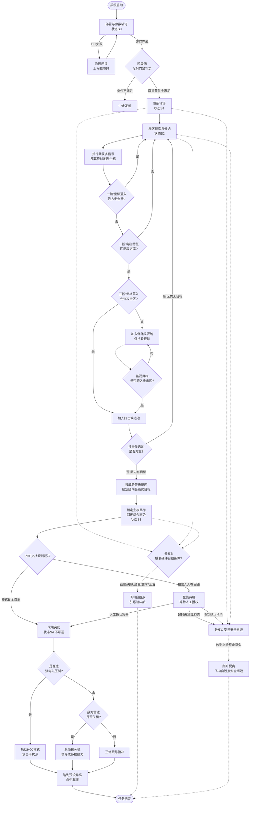

**文档版本：** V1.5
**适用对象：** JWS01反辐射无人机系统
**核心定位：** 防空压制（SEAD）与精确打击（一次性巡飞消耗品）

---
# 系统组成

JWS01并非单架飞行器，而是一个完整的“侦察-打击-评估”武器系统。系统主要由**无人机平台、任务载荷、地面控制与保障系统**三大分系统构成。

## 1. 无人机平台分系统 (空中部分)
*   **机身与结构：** 采用隐身外形设计（多面体或飞翼布局），机体材料选用透波复合材料（如玻璃纤维/碳纤维混编），以降低雷达散射截面积（RCS），减少被敌方防空系统发现的概率。采用**零返回一次性设计**，无起落架等回收装置。
*   **动力系统：** 通常采用小型涡喷发动机或高效活塞发动机（提供长航时），配备螺旋桨或推进式涵道风扇。具备在复杂气象条件下的稳定工作能力。
*   **飞行控制与导航系统：**
    *   **飞控计算机：** 无人机的大脑，负责全姿态控制、航路跟踪。
    *   **导航模块：** 惯性导航系统（INS）与北斗/GPS多模卫星导航系统（GNSS）深度耦合，可选配地形跟随（TF）雷达或激光高度计，支持低空超低空突防。

## 2. 任务载荷分系统 (核心杀伤链)
*   **宽带被动雷达导引头 (PRH)：** 核心传感器。覆盖典型的L、S、C、X等防空雷达频段。具备高灵敏度、高测向精度（DOA）和强大的信号分选能力，能在高密度电磁环境中精准锁定目标雷达。
*   **多模末制导单元（可选配置）：** 针对敌方雷达“关机”策略，可加装微型毫米波雷达或红外成像导引头，实现“辐射源丢失后的视觉/雷达寻的”。
*   **战斗部与引信：**
    *   **战斗部：** 采用破片杀伤战斗部或聚能破甲战斗部（针对雷达天线罩或方舱），配备预制破片，确保有效摧毁半径。
    *   **引信：** 采用复合引信体制（如：无线电定高引信 + 毫米波近炸引信 + 触发/延期引信），确保在复杂气象、烟尘及地形起伏下实现最佳高度/角度起爆。
*   **数据链终端：** 包含宽频加密数据链电台，用于上行接收指令、下行回传状态和遥测数据，支持无线电静默模式。

## 3. 地面控制与保障分系统 (地面部分)
*   **指挥控制方舱 (GCS)：** 集成任务规划工作站、综合显控台、态势感知屏幕。操作手在此进行任务解析、航路规划、参数装订及发射控制。
*   **发射单元：** 多联装发射车（箱式或导轨式），具备快速起竖、发射功能，支持单车多发齐射，形成饱和压制能力。
*   **检测与装订设备：** 地面便携式测试仪，用于发射前的全面BIT（机内测试）检测，以及通过有线方式向飞控和导引头高速注入目标库和航路数据。
*   **后勤保障设备：** 包含电源车、加注设备、无人机体储存箱、运弹车等。

---

# 运行流程

## 1. 阶段一：无人机部署

本阶段为物理层面的准备与系统唤醒，由基层操作人员完成。

*   **1.1 运输与展开：** 将JWS01无人机由储存箱/发射车取出，安装至发射导轨或发射箱内。
*   **1.2 物理连接：** 连接地面检测设备、数据加载线缆及供气/供电测试接口。
*   **1.3 系统自检 (BIT)：**
    *   飞控系统自检（舵机、IMU、高度计）。
    *   动力系统自检（发动机/电动机点火电路、燃油/电量余量）。
    *   引信与战斗部检测（安全保险状态确认）。
    *   **载荷自检（核心）：** 宽带被动雷达侦察导引头（PRH）灵敏度与频段覆盖测试。
    *   *异常处理：若自检未通过，系统将物理闭锁发射电路，并向地面控制站（GCS）上报具体故障码，禁止带病作业。*
*   **1.4 状态上报：** 自检通过后，无人机向地面控制站（GCS）上报“ readiness ”（就绪）状态，进入待命行列。

## 2. 阶段二：接收上级任务

本阶段为战术指挥链条的信息下达过程，通常由营/旅级指挥所发起。

*   **2.1 任务下达：** 上级指挥系统通过数据链（无线宽带或光纤）向GCS下发任务指令。
*   **2.2 任务要素解析：** GCS解析任务报文，提取核心要素：
    *   **任务类型：** 压制性巡飞（待机寻歼）、定点清除（已知坐标打击）、随遇打击（发现即摧毁）。
    *   **目标特征：** 敌方雷达型号、工作频段、脉冲重复频率（PRF）、大致坐标范围。
    *   **时间窗口：** 起飞时间、巡飞时间限制、最终打击截止时间。
*   **2.3 任务确认：** 操作手在GCS上核对任务信息，点击“确认接收”，系统锁定任务。

## 3. 阶段三：任务设置与参数装订

本阶段是将战术意图转化为无人机可执行的机器代码的过程。

*   **3.1 巡航路径与安全线（地理围栏）装订：**
    *   **巡航路径设置：** 输入初始转向点（WPT）、巡航航路点及进入目标的航路角。结合DEM高程数据规划低可探测性路径，利用地形掩蔽避开敌方防空探测范围。
    *   **安全线设置：** 强制划定地理围栏与绝对禁飞区。注入己方阵地、友邻部队坐标及人口密集区等作为防误伤的硬性红线。
*   **3.2 目标特征设置（辐射源指纹库）：**
    *   将敌方雷达的“电磁指纹”数据写入导引头非易失性存储器，包括敌方雷达型号、工作频段、脉冲重复频率（PRF）、脉冲宽度（PW）及扫描样式。
    *   设定**可配置的威胁等级优先级**（依据当前战术任务动态排序，如预警雷达与火控雷达的优先级切换）。
    *   设定“辐射源容限阈值”（信号强度达到设定dBm才确认为真目标，过滤背景噪声与诱饵）。
*   **3.3 搜索路径与攻击区设置：**
    *   **搜索路径设置：** 在飞行参数中设定搜索航线（如椭圆盘旋、八字形、矩形扫描），系统依据导引头视场角与探测距离自动计算航线间距。**搜索路径应完全覆盖攻击区。**
    *   **攻击区设置：** 根据任务类型划定允许开火的空间多边形区域（2D坐标+高度层）。设定交叉比对逻辑：**必须同时满足"电磁特征匹配"且"当前坐标位于攻击区内"，才解锁攻击权限。**
*   **3.4 自毁点与目标炸高设置：**
    *   **自毁点/条件设置：** 设定多重自毁触发逻辑的阈值，包括能源告警阈值、偏航越界距离、导航失锁时间、最大巡飞时间限制，以及**预设的无人区/海域安全坠毁坐标（自毁点）**。
    *   **目标炸高设置：** 依据战斗部类型（破片杀伤或聚能破甲）及目标架设方式，设定引信的相对离地起爆高度参数（AGL）。
*   **3.5 交战规则 (ROE) 设定：**
    *   **模式A（严格授权/人在回路）：** 仅打击预先装订的特定频段/型号雷达，且**必须由人工操作手最终确认**后方可开火。
    *   **模式B（全自主泛化压制）：** 打击搜索区内任何开启的敌方防空雷达（优先级最高者），无人机发现即摧毁，无需人工介入。
*   **3.6 参数固化与断开：**
    *   注入动态加密密钥，建立安全数据通道。
    *   参数写入机载飞控与导引头后，执行全量数据回读与CRC校验，确保“装订即一致”。
    *   拔除物理线缆，无人机转为“机载自主供电”状态。

## 4. 阶段四：发射

*   **4.1 发射硬性门禁判定（四重互锁）：** GCS按以下顺序检查，任一条件不满足即断开点火电路：
    1.  **安全第一：** 战斗部引信处于绝对安全状态。
    2.  **导航基础：** INS（惯导）对准完成，GNSS（北斗/GPS）定位授时正常。
    3.  **防误伤：** 发射坐标未落入装订的"地理围栏/禁飞区"。
    4.  **飞行安全：** 发射区空域清空。
*   **4.2 发射指令：** 操作手按下“发射”按钮（或上级一键统发）。
*   **4.3 动力启动与离轨：** 助推器点火（或气动弹射/抛投），无人机离轨。
*   **4.4 初始姿态建立：** 无人机在0.5~2秒内完成俯仰、偏航、滚转的稳定控制，爬升至预定巡航高度，向第一个航路点切入。
*   **4.5 链路切换：** 若发射时使用短距有线链路，此时自动切换至超短波/卫星数据链，向GCS发送“Launch Success”信号。

## 5. 阶段五：巡航

本阶段强调低损耗、隐蔽性到达预定战区。

*   **5.1 导航飞行：** 依赖“INS+GNSS”耦合导航进行飞行，严格跟踪装订的巡航路径。
*   **5.2 射频静默：** 在飞越敌方防空警戒线前，数据链保持“只听不说”状态，被动雷达导引头处于低功耗休眠状态，降低被敌方电子侦察发现的概率。
*   **5.3 阵位抵近：** 按照装订的航路点飞行，到达“搜索起始点”。

## 6. 阶段六：搜索与分选（多目标候选池机制）

到达战区后，JWS01进入核心的“猎杀”状态。面对复杂的电磁环境，导引头具备多信号并行处理能力，系统采用**“基于绝对地理坐标的三阶漏斗过滤 + 候选池动态仲裁”**逻辑。

*   **6.1 开启搜索：** 飞至预定盘旋区域，按照设定的搜索路径飞行，被动雷达导引头全功率开机。
*   **6.2 信号截获与快速定位：** 导引头同时截获空间中的多个脉冲信号，利用无人机在搜索航线上的位移，对各信号进行交叉定位，**解算出所有辐射源的“绝对地理坐标”**。
*   **6.3 第一阶过滤：安全线红线审查（防误伤）：**
    *   将所有解算出的辐射源坐标，与全局地图上的“安全线/地理围栏”比对。
    *   **判定：坐标落入己方安全线内的信号，直接从内存中底层剔除，不进入后续流程。**
*   **6.4 第二阶过滤：电磁特征分选（辨真伪）：**
    *   对安全线外的信号提取精细参数（RF、PW、PRF等），与“目标特征库”比对。
    *   **判定：剔除背景噪声、民用信号及不匹配的敌方非目标辐射源。**
*   **6.5 第三阶过滤与候选池构建（空间与威胁的分离）：**
    *   对于特征匹配的敌方目标，根据其绝对坐标，将其分流注入两个逻辑队列：
        *   **打击候选池：** 坐标位于预设“攻击区”多边形内的敌方目标。
        *   **伴随监视池：** 坐标位于“攻击区”外的敌方高价值目标。
*   **6.6 多目标仲裁与锁定逻辑（解决冲突的核心）：**
    *   **核心准则：空间权限高于威胁等级。**
    *   **区内仲裁：** 系统实时检视**“打击候选池”**。如果池中有目标，系统严格按照装订的“威胁等级优先级”进行排序，**始终锁定池中优先级最高的目标**（机头指向它，准备攻击）。
    *   **越界提拔：** 系统利用多余的处理通道，对**“伴随监视池”**中的目标（如区外的最高级预警雷达）保持测向跟踪。**一旦发现该目标移动或因坐标更新而进入了“攻击区”，系统立即将其从监视池“提拔”至打击候选池**，参与最高优先级竞争。
    *   **空池处理：** 如果“打击候选池”为空（区内没目标），即使“伴随监视池”里有最高级目标，无人机也**拒绝执行攻击动作**，继续保持搜索航线飞行，等待区内出现目标或区外目标跨入。
    *   **态势回传：** 无人机将“打击候选池排序第一的目标”作为主攻目标，将“伴随监视池的高优目标”作为态势信息，一并回传地面控制站（GCS）。

## 7. 阶段七：末端决策与执行

根据搜索结果和装订的交战规则（ROE），JWS01将进入以下逻辑分支。**注：因JWS01为一次性消耗品，全生命周期不包含返航程序。**

### 前置逻辑：ROE权限裁决
*   **若装订为“模式B（全自主泛化压制）”：** 跳过人工干预，完成6.6节后直接进入【分支A：正常打击】。
*   **若装订为“模式A（严格授权/人在回路）”：** 在完成6.6节后，无人机进入“盘旋待机”状态，机头始终指向目标。地面操作手必须在规定时间窗口内点击“最终攻击授权”。若超时未授权或收到终止指令，直接转入【分支C：任务终止】。

### 分支A：正常打击
*   **触发条件：** 通过前置逻辑裁决，获得最终开火权限。
*   **俯冲拉起：** 无人机根据导引头提供的视线角，调整航向对准目标。对于顶部攻击型反辐射无人机，通常会先俯冲加速，然后在目标上方拉起，进入大角度俯冲。
*   **抗关机处理：** 若在俯冲过程中敌方雷达突然关机，JWS01启动**抗关机逻辑**：
    *   **记忆外推航迹：** 基于最后锁定的目标位置、运动参数和雷达扫描周期，通过卡尔曼滤波算法预测目标当前位置，外推时间不超过30秒。
    *   **GPS/INS惯导接力：** 雷达信号消失后立即切换至纯惯导模式，结合GPS数据实时修正导航误差，继续攻击外推坐标。
    *   **多模末制导备份：** 当目标距离小于5公里时，自动激活毫米波雷达或红外成像导引头，通过视觉或雷达成像确认目标位置。
*   **引信解保与炸高控制：** 距目标设定距离时解除战斗部引信安全保险。末端开启下视测高（无线电/激光高度计），当达到装订的**目标炸高**（相对离地高度）时，引信起爆。
*   **命中起爆：** 在最佳高度形成破片飞散区，摧毁目标雷达天线或掩体。无人机向GCS回传最后坐标及“Target Destroyed”信号后，生命终结。

### 分支B：程序自毁
*   **触发条件（按以下优先级顺序判断，满足任一即触发）：**
    1.  **战损失控（最高优先级）：** 遭到防空火力击中主翼等不可逆损伤，姿态失控。
    2.  **导航失效：** INS严重漂移且GNSS长时间失锁，无法维持飞行。
    3.  **偏航越界：** 飞出任务边界（突破安全线特定距离或飞出攻击区过远）。
    4.  **超时未果：** 达到装订的最大巡飞时间限制。
    5.  **能源告警：** 燃油/电量耗尽达到安全阈值以下，且未发现目标。
*   **自毁逻辑：** 飞控切断发动机动力，自主导航飞向预设的**自毁点（无人区/海域安全坠毁区）**，启动空中爆破程序（引爆战斗部）或触地引爆，**绝对避免整机及核心技术被敌方完整缴获**。

### 分支C：任务终止（受控安全自毁）
*   **设计基调：** JWS01定位为一次性巡飞消耗品，采用“零返回”设计，**不具备返航降落能力**。任务一旦终止，必须执行自毁程序，以防带弹失控或落入己方阵地造成次生灾害。
*   **触发条件（满足任一即触发）：**
    1.  **上级干预：** 战场态势突变（如己方部队已推进至该区域，或敌方已投降），GCS下发“任务终止”指令。
    2.  **人在回路超时/拒否：** 在模式A下，操作手未在规定时间内点击“攻击授权”，或主动点击“取消攻击”。
    3.  **目标属性突变：** 锁定后、俯冲前，持续交叉定位发现辐射源坐标发生大幅移动，落入装订的“安全线”内。
*   **终止执行逻辑：**
    *   收到终止指令后，飞控系统**立即解除导引头对目标的锁定**，停止俯冲或盘旋待机动作。
    *   无人机爬升至安全高度，关闭被动雷达导引头以防止二次误锁。
    *   飞控系统接管导航，**自主飞向预设的“安全自毁点”**。
    *   到达自毁点后，执行**程序自毁**（切断动力，引爆爆破装药破坏机体结构及核心电路板，主战斗部视情况低当量引爆或不引爆），确保残骸不可逆向工程。

---

## 附录：异常处理与抗干扰逻辑（贯穿全阶段）

*   **GNSS欺诱骗防御：** 巡航中若检测到卫星信号异常（多径效应或电平异常），立即切换至纯INS模式，降低对卫星的依赖，并向GCS报警。
*   **Home-on-Jam（干扰源寻的）：** 在搜索或打击阶段，若遭到敌方宽频电磁压制干扰，导致无法识别具体雷达型号，JWS01可将“最强干扰源”视为最高威胁目标，直接引导无人机顺着干扰波束实施物理摧毁（反辐射无人机的隐藏杀手锏）。
*   **数据链中断：** 飞行途中若与GCS失联，无人机严格按照最后装订的航路、安全线和ROE继续执行自主任务（若失联前处于“人在回路”待机状态，则默认超时，转入【分支C】），不因失联而悬停或返航，确保SEAD任务的闭环。

---

# 详细逻辑流程图
### 方案一：极简兼容版 Mermaid 流程图



---

### 方案二：纯文本树状逻辑图（100%防乱码）

```text
[系统启动]
  │
  ├─▶ [S0] 部署与参数装订
  │     ├─▶ (BIT失败) ➔ 物理闭锁, 排故
  │     └─▶ (装订完成) ➔ 发射门禁判定 (引信/北斗/围栏/空域)
  │           ├─▶ (不满足) ➔ 【中止发射】
  │           └─▶ (全满足) ➔ [S1] 隐蔽转场
  │                 │
  │                 ├─▶ (后台监控: 战损/失联/越界/超时/无油) ➔ 【S5分支B: 程序自毁】➔ 飞向自毁点引爆 ➔ 结束
  │                 ├─▶ (后台监控: 收到上级终止指令) ➔ 【S5分支C: 受控安全自毁】➔ 飞向自毁点销毁 ➔ 结束
  │                 │
  │                 └─▶ 抵达战区 ➔ [S2] 搜索与分选 (多目标候选池机制)
  │                       │
  │                       └─▶ 并行截获多信号 ➔ 解算所有绝对地理坐标
  │                             │
  │                             ├─▶ 【一阶过滤: 坐标在己方安全线内?】
  │                             │     └─▶ (是) ➔ 底层强制剔除
  │                             │
  │                             └─▶ (否) ➔ 【二阶过滤: 电磁特征匹配敌方库?】
  │                                   │     └─▶ (否) ➔ 剔除虚警
  │                                   │
  │                                   └─▶ (是) ➔ 【三阶分流: 坐标在攻击区内?】
  │                                         │
  │                                         ├─▶ (否) ➔ 放入【伴随监视池】(持续测向)
  │                                         │     └─▶ (若该目标移动进入攻击区) ➔ 立即转入打击池
  │                                         │
  │                                         └─▶ (是) ➔ 放入【打击候选池】
  │                                               │
  │                                               └─▶ 候选池是否为空?
  │                                                     ├─▶ (空) ➔ 继续搜索, 拒绝攻击区外目标
  │                                                     └─▶ (非空) ➔ 按威胁等级排序, 锁定区内最高优 ➔ [S3] 回传态势
  │
  ├─▶ [S3] 锁定决策 (ROE裁决)
  │     ├─▶ (装订模式B: 全自主) ➔ 直接获得权限 ➔ [S4] 末端突防
  │     └─▶ (装订模式A: 人在回路) ➔ 盘旋待机等待人工
  │           ├─▶ (超时未决/人工拒否/收到终止) ➔ 【S5分支C: 受控安全自毁】
  │           └─▶ (人工按下确认攻击) ➔ [S4] 末端突防
  │
  ├─▶ [S4] 末端突防 (不可逆)
  │     ├─▶ (遭强电磁压制致盲) ➔ 启动HOJ: 顺干扰波束攻击
  │     ├─▶ (敌方雷达突然关机) ➔ 启动抗关机: 惯导外推/多模导引接力
  │     └─▶ (正常跟踪) ➔ 俯冲加速
  │           └─▶ 【达到预设炸高, 引信起爆, 回传坐标】➔ [任务结束]
  │
[全局状态 S5 说明 (零返回设计，无返航逻辑)]
  ├─ 分支B (程序自毁): 触发硬件/软件极限阈值 ➔ 切断动力 ➔ 飞向预设自毁点 ➔ 引爆战斗部
  └─ 分支C (受控安全自毁): 战术态势终止/人工放弃 ➔ 爬升脱离战区 ➔ 飞向预设自毁点 ➔ 销毁核心电路
```

### 附：纯文本版流程结构（防图形无法渲染）

*   **【启动与准备】**
    *   系统部署 -> 系统自检(BIT)
    *   *自检失败？-> 返回故障排查。*
    *   *自检成功？-> 接收上级任务。*
*   **【装订与发射】**
    *   任务参数装订（含路径、安全线、攻击区、特征、自毁点、炸高、ROE模式）-> 发射起飞 -> 巡航飞行。
*   **【战区搜索循环（多目标三阶坐标漏斗）】**
    *   到达战区，导引头开机，按搜索路径飞行。
    *   *并行截获信号 -> 解算绝对坐标 -> 判断1：坐标在安全线内吗？*
        *   **是** -> 丢弃信号，继续搜索。
        *   **否** -> *判断2：电磁特征匹配敌方吗？*
            *   **否** -> 丢弃信号，继续搜索。
            *   **是** -> *判断3：坐标在攻击区内吗？*
                *   **否** -> 放入【伴随监视池】跟踪，若跨入攻击区则提拔。（若区内仍无目标，继续搜索）。
                *   **是** -> 放入【打击候选池】。
    *   *候选池仲裁：池内是否有目标？*
        *   **无** -> 继续搜索。
        *   **有** -> 按优先级锁定区内最高优目标，进入ROE裁决。
    *   *(注：搜索全程若触发硬件故障/无油/越界等 -> 【分支B：程序自毁】)*
*   **【ROE裁决与末端打击】**
    *   *判断4：当前是哪种交战模式？*
        *   **全自主模式** -> 直接进入打击。
        *   **人在回路模式** -> 悬停待机。
            *   *判断5：人工是否授权？*
                *   **否/超时** -> 【分支C：受控安全自毁】。
                *   **是** -> 进入打击。
    *   进入俯冲打击（注：此阶段若接收到终止指令，立即转入【分支C】）。
    *   *判断6：是否被敌方强电磁干扰致盲？*
        *   **是** -> 启动HOJ模式（攻击干扰源）-> 达到炸高起爆 -> 结束。
        *   **否** -> *判断7：敌方雷达是否关机？*
            *   **是** -> 启动抗关机逻辑（纯惯导/多模导引记忆攻击）-> 达到炸高起爆 -> 结束。
            *   **否** -> 正常跟踪 -> 达到炸高起爆 -> 结束。