下面给你一个更工程化、更细的运行逻辑流程图（把“状态-条件-动作”拆开，适合写进系统设计/需求规格）。然后再简要串一下系统组成（结构化、方便你后续写入文档）。

---

## 一、更细的 JWS01 运行逻辑流程图

说明：
- 状态节点（矩形）：代表一个稳定飞行状态/阶段。
- 判断节点（菱形）：代表实时逻辑判断。
- 动作/处理节点（圆角矩形）：代表需要执行的具体动作（装订、计算、切换模式等）。
- 子流程（双竖线矩形）：表示某个内部逻辑可以再展开，这里用名字概括。

```mermaid
flowchart LR

%% ============ A. 预置与装订阶段 ============
Start([冷态部署]) --> Pwr[供电/气/测试接口连接]
Pwr --> BIT[系统自检 BIT]
BIT -->|失败| Fault[故障定位&更换/维修] --> BIT
BIT -->|成功| Link[GCS连接&握手]

%% 接收任务（这里细化“任务类型”）
Link --> RcvTask[接收上级任务报文]
RcvTask --> TaskParse[解析任务类型与要素]
TaskParse --> TaskCheck{任务要素是否完整?}
TaskCheck -->|否| ErrMsg[向GCS报参数缺失] --> TaskParse
TaskCheck -->|是| PlanRoute[航路/禁飞区/搜索区规划]
PlanRoute --> WptLoad[装订航路点参数]
WptLoad --> TgtLib[装订威胁库&目标优先级]
TgtLib --> ROE[装订ROE: 严格/泛化模式]
ROE --> ParamSave[参数固化到非易失存储]
ParamSave --> ArmSafe[战斗部/引信处于安全状态]
ArmSafe --> Unplug[断开地面线缆]
Unplug --> Ready[进入发射前就绪状态]

%% ============ B. 发射与转入巡航 ============
Ready --> PreLaunch[发射前最终检查: GPS/北斗、链路、禁飞区装订]
PreLaunch --> GoLaunch{发射条件是否满足?}
GoLaunch -->|否| Wait[等待/修正条件] --> PreLaunch
GoLaunch -->|是| LaunchCmd[执行发射: 助推器点火/弹射/抛投]
LaunchCmd --> Climb[离轨&姿态建立&爬升]
Climb --> NavMode[切入巡航导航模式: INS+GNSS]

%% ============ C. 巡航/转场 ============
NavMode --> SilEntry[按任务选择: 射频静默 ON/OFF]
SilEntry --> ToLoiter[按航路点飞向搜索区/巡逻区]

%% ============ D. 搜索/巡逻（核心状态机） ============
ToLoiter --> Loiter[进入巡逻/搜索状态: 8字/矩形航线]
Loiter --> SensorCtrl[被动雷达导引头工作模式]
SensorCtrl --> Scan[频段扫描&截获脉冲]
Scan --> SigSort[信号分选: RF/PW/PRF/DOA]
SigSort --> ID{是否在威胁库且优先级达标?}
ID -->|否| Filter[标记为非目标/干扰&继续搜索]
Filter --> Scan
ID -->|是| PreLock[预锁定: 多次确认稳定跟踪]

PreLock --> FriendCheck{是否落入禁飞区/白名单?}
FriendCheck -->|是| AbortFriend[判定为友方/误目标&中止攻击] --> Loiter
FriendCheck -->|否| Lock[正式锁定目标&计算攻击航迹]

%% ============ E. 攻击决策与执行（含多分支） ============
Lock --> Divert{上级是否下达终止/返航/改目标?}
Divert -->|是| Terminate[执行终止逻辑] --> Loiter
Divert -->|否| ArmDecision[根据ROE判断: 可否自动开战?]
ArmDecision --> Manned{数据链是否正常&人在回路?}
Manned -->|是&需人工确认| WaitHuman[悬停/盘旋&上报目标&等待GCS确认]
WaitHuman --> HumanOk{GCS是否下达攻击指令?}
HumanOk -->|否| AbortM[中止攻击&返回Loiter] --> Loiter
HumanOk -->|是| ArmOk[引信解保&进入攻击程序]
Manned -->|否或完全自主| ArmAuto[根据ROE自动决策攻击] --> ArmOk

ArmOk --> Dive[俯冲/拉起进入攻击航线]

%% ============ F. 末端复杂情况处理 ============
Dive --> JamCheck{是否遭遇强压制干扰?}
JamCheck -->|是| HOJ[Home-on-Jam: 将最强干扰源视为目标] --> Explode
JamCheck -->|否| ShutdownCheck{目标雷达是否突然关机?}
ShutdownCheck -->|是| AntiShutDown[抗关机: 记忆外推+INS/GPS末段+多模备份导引] --> Explode
ShutdownCheck -->|否| Explode[命中点: 引信起爆&毁伤&上报最后坐标]

%% ============ G. 自毁/返航/终止逻辑 ============
Loiter --> SelfCheck{触发自毁条件?}
SelfCheck -->|是: 燃油/电量不足| SD1[选择安全区&执行空中/触地自毁]
SelfCheck -->|是: 导航/姿态严重异常| SD2[失控前主动引爆/破坏关键电路]
SelfCheck -->|是: 飞出任务边界/超时| SD3[边界外自毁或安全区坠毁]
SD1 --> End([任务结束&效果评估])
SD2 --> End
SD3 --> End

Terminate --> TermLogic{是否具备返航/回收能力?}
TermLogic -->|是&上级允许| Return[爬升&切断战斗部电源&按返航航线着陆/伞降]
TermLogic -->|否| TermSD[在安全区执行程序自毁]
Return --> End
TermSD --> End

Explode --> End
```

你可以把上面的图理解为“顶层状态机+关键判断”。如果需要再细化，可以按以下子流程拆开（建议在文档中用多个小图）：

- 子流程1：发射前 BIT 与装订流程
- 子流程2：航路点/搜索区/禁飞区规划与校验
- 子流程3：目标信号截获、分选、识别与优先级排序
- 子流程4：攻击中止/返航/自毁决策矩阵（含所有触发条件）

---

## 二、系统组成（结构化，可直接写入“系统组成”章节）

### 1. 总体思路

JWS01 通常作为一个“武器系统”来设计，包含：  
- 空中段（无人机平台 + 任务载荷）  
- 地面段（指挥控制 + 发射/保障/检测）  
- 链路与保障（数据链、电源、储运）

### 2. 空中段（无人机平台 + 任务载荷）

2.1 无人机平台  
- 机身与结构：隐身外形（多面体/飞翼）、透波材料、小RCS。  
- 动力装置：小型涡喷/活塞/电动机（长航时），可选助推器。  
- 飞控与导航：  
  - 飞控计算机：姿态控制、航路跟踪、自动起降、任务状态机。  
  - 导航：INS + GNSS（北斗/GPS）紧耦合；可加地形跟随/景象匹配。  
- 数据链终端：  
  - 宽带加密双向数据链；支持无线电静默、猝发通信、中继。  

2.2 任务载荷  
- 宽带被动雷达导引头（PRH）：  
  - 覆盖 L/S/C/X 等典型防空雷达频段；  
  - 高灵敏度、高测向精度（DOA）；  
  - 支持信号分选、威胁分类、优先级排序。  
- 多模末制导（可选）：  
  - 毫米波雷达/红外成像，用于雷达关机后的末段制导。  
- 战斗部与引信：  
  - 战斗部：破片/聚能破甲/多模，适应不同雷达方舱/天线。  
  - 引信：激光近炸 + 触发，复合保险逻辑。  

### 3. 地面段（指挥控制 + 发射/保障/检测）

3.1 指挥控制方舱（GCS）  
- 任务规划工作站：  
  - 任务解析、航路规划、禁飞区/搜索区设置；  
  - 威胁库装订与 ROE 配置。  
- 综合显控台：  
  - 态势显示、无人机状态监视、遥测参数显示；  
  - 攻击确认/中止、返航/自毁指令下发。  
- 记录与回放：任务数据、遥测、视频/雷达回波记录。  

3.2 发射单元  
- 发射车/发射箱：  
  - 多联装导轨/箱式，支持快速起竖、齐射、扇面覆盖。  
  - 发射控制接口与安全联锁。  

3.3 检测与装订设备  
- 地面 BIT 设备：对飞控、导航、载荷、引信进行综合测试。  
- 参数装订终端：通过有线/近场无线向机载飞控/导引头写入任务数据。  

3.4 后勤保障  
- 电源车、加注设备（燃油/特殊燃料）；  
- 储运箱/包装箱，符合环境与搬运要求；  
- 运弹车、吊装设备、工具箱等。  

### 4. 链路与保障系统

- 数据链网络：  
  - 地面-空中双向；  
  - 可支持多机编队、中继、与上级 C2 系统接入。  
- 通信安全与抗干扰：  
  - 加密、跳频、抗压制、抗欺骗；  
  - 对 GNSS 欺骗/干扰检测与防御。  
- 环境与运输保障：  
  - 温湿度控制、防静电、防震、防雨雪。  

---

如果你接下来需要，我可以把上面的每个子流程再拆成更细的“步骤-条件-输出”表格（适合作为需求/接口控制文档（ICD）输入），或者按“状态机描述”形式写成需求条目。