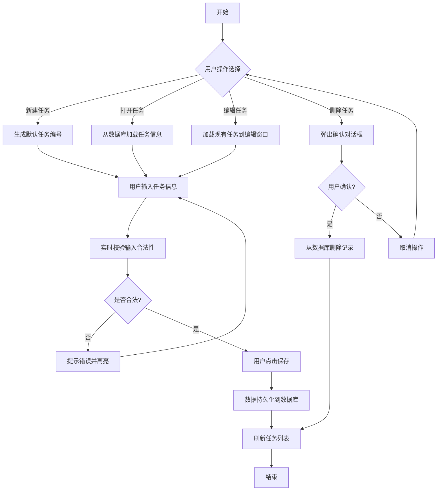
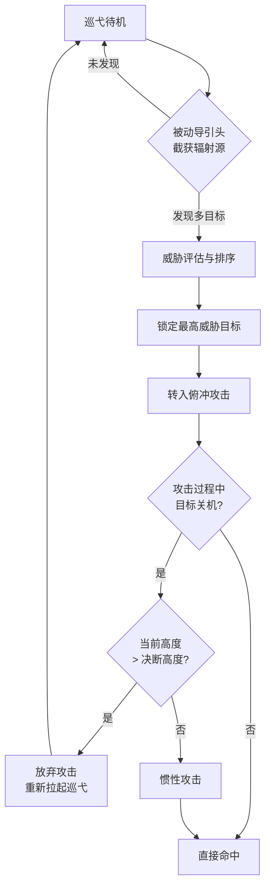

# 需求说明
## 反辐射无人机仿真系统 - 协同任务规划模块需求规格说明

### 一、需求概述

| 项目 | 内容 |
|------|------|
| **需求名称** | 协同任务管理功能 |
| **需求标识** | CTRM-001 |
| **需求概述** | 提供协同任务的创建、编辑、保存、打开、删除等全生命周期管理功能，支持设置任务的基本信息（任务名称、编号、类型、目标、起止时间等），为后续协同任务配置提供基础数据。 |
| **需求来源** | 系统总体设计要求 / 作战仿真需求 / 协同任务规划指标 |
| **前置条件** | 1. 用户已登录系统并具有任务管理权限；<br>2. 系统已加载基础地理信息数据；<br>3. 无人机资源池和目标库已初始化。 |
| **触发条件** | 1. 用户点击“新建任务”按钮；<br>2. 用户双击任务列表中的现有任务；<br>3. 用户点击“打开任务”按钮选择历史任务文件。 |
| **退出条件** | 1. 用户保存任务并关闭编辑界面；<br>2. 用户取消编辑返回任务列表；<br>3. 系统异常退出。 |
| **功能参与者** | 1. 任务规划员（主要）；<br>2. 指挥员（审核）；<br>3. 系统管理员（管理）。 |
| **输入/输出** | **输入**：任务基本信息（名称、编号、类型、目标、时间等）；<br>**输出**：协同任务文件（XML/JSON格式）、任务列表更新、任务状态变更。 |
| **后置条件** | 1. 任务信息持久化存储至数据库/文件系统；<br>2. 任务列表刷新显示新增/修改的任务；<br>3. 触发协同任务配置模块可用状态更新。 |
| **显示约束** | 1. 采用深色主题界面，符合军事软件风格；<br>2. 任务列表应支持分页、排序、筛选；<br>3. 时间选择控件支持日期和时间同时设置；<br>4. 任务类型以下拉框形式提供预定义选项。 |
| **其他约束** | 1. 任务编号应唯一，支持自动生成和手动输入；<br>2. 任务名称长度不超过50个字符；<br>3. 支持同时打开多个任务编辑窗口（最多5个）；<br>4. 操作响应时间不超过2秒。 |

---

### 二、处理流程

#### 2.1 正常流程

| 步骤 | 操作 | 系统响应 |
|------|------|----------|
| 1 | 用户进入协同任务管理模块，点击“新建任务”按钮 | 弹出任务编辑窗口，生成默认任务编号（如CT-YYYYMMDD-XXX），各字段为默认值 |
| 2 | 用户输入任务名称（如“北走廊防空压制”） | 实时校验任务名称是否为空、是否重复 |
| 3 | 用户选择任务类型（从预定义下拉框中选择） | 根据任务类型动态调整其他字段的默认值（如SEAD类型默认优先级较高） |
| 4 | 用户输入/选择任务目标（可从目标库选择或手动输入） | 如从目标库选择，自动填充目标坐标和特征信息 |
| 5 | 用户设置计划开始时间和结束时间 | 校验结束时间不早于开始时间，时间格式正确 |
| 6 | 用户点击“保存”按钮 | 系统校验所有必填字段，生成任务ID，将任务信息存入数据库，刷新任务列表 |
| 7 | 用户从任务列表中选择一个任务，点击“打开” | 加载任务详细信息到编辑窗口，允许修改 |
| 8 | 用户修改任务信息后点击“保存” | 更新数据库中对应任务记录，刷新列表显示 |
| 9 | 用户选择一个或多个任务，点击“删除” | 弹出确认对话框，确认后从数据库中删除任务记录，刷新列表 |

#### 2.2 异常流程

| 异常场景 | 处理方式 |
|----------|----------|
| 任务编号重复 | 保存时提示“任务编号已存在，请重新输入”，并高亮编号输入框 |
| 必填字段为空（任务名称、类型、目标） | 保存时提示“请填写完整任务信息”，并标记缺失字段 |
| 时间格式错误或结束时间早于开始时间 | 保存时提示“时间设置无效”，并高亮时间输入框 |
| 网络中断导致保存失败 | 提示“保存失败，请检查网络连接”，保留当前编辑内容 |
| 同时打开超过5个编辑窗口 | 提示“同时编辑的任务数量已达上限”，禁止新建窗口 |
| 删除操作未确认 | 取消删除操作，返回任务列表 |

---

### 三、成功判据

| 编号 | 判据描述 |
|------|----------|
| SC-01 | 用户成功创建新任务，任务在列表中显示，所有输入字段正确保存 |
| SC-02 | 用户成功打开已有任务，编辑窗口显示正确的任务信息 |
| SC-03 | 用户成功修改任务信息，保存后列表中的任务信息更新 |
| SC-04 | 用户成功删除任务，任务从列表中消失，数据库记录移除 |
| SC-05 | 任务编号唯一性约束得到保证，无重复编号 |
| SC-06 | 所有必填字段在保存前都经过校验 |
| SC-07 | 任务文件导入/导出功能正常（如有） |

---

### 四、输入输出信息表

| 数据名称 | 输入/输出 | 提供方 | 使用方 | 用途 | 备注 |
|----------|-----------|--------|--------|------|------|
| 任务编号 | 输入/输出 | 用户/系统生成 | 任务列表、协同配置 | 任务唯一标识 | 格式：CT-YYYYMMDD-XXX |
| 任务名称 | 输入/输出 | 用户 | 任务列表、详情显示 | 任务简要描述 | 长度≤50字符 |
| 任务类型 | 输入/输出 | 用户 | 任务分类、筛选 | 确定任务性质 | 预定义类型：SEAD、对地攻击、侦察、干扰等 |
| 任务目标 | 输入/输出 | 用户/目标库 | 任务执行 | 明确打击/侦察对象 | 可多目标，支持从库选择 |
| 目标坐标 | 输入/输出 | 用户/GIS系统 | 航路规划 | 目标地理位置 | 经纬度格式 |
| 计划开始时间 | 输入/输出 | 用户 | 任务调度 | 任务执行起始时间 | 格式：YYYY-MM-DD HH:MM |
| 计划结束时间 | 输入/输出 | 用户 | 任务调度 | 任务执行结束时间 | 不早于开始时间 |
| 任务优先级 | 输入/输出 | 用户 | 资源分配 | 确定任务重要程度 | 1-5级，5为最高 |
| 任务状态 | 输出 | 系统 | 任务列表 | 显示当前任务状态 | 待执行/执行中/已完成/已中止 |
| 创建人 | 输出 | 系统 | 日志审计 | 记录任务创建者 | 从用户会话获取 |
| 创建时间 | 输出 | 系统 | 日志审计 | 记录任务创建时间 | 自动生成 |
| 关联无人机 | 输入/输出 | 用户 | 任务执行 | 指定执行任务的无人机 | 可从资源池选择 |
| 任务描述 | 输入/输出 | 用户 | 详情显示 | 补充说明 | 文本区域，长度≤200字 |

---

### 五、分析流程



---

### 六、性能需求

| 需求项 | 指标要求 |
|--------|----------|
| 响应时间 | 1. 任务列表加载时间 ≤ 2秒（1000条任务数据）；<br>2. 任务保存响应时间 ≤ 1秒；<br>3. 任务删除响应时间 ≤ 1秒；<br>4. 界面切换响应时间 ≤ 0.5秒。 |
| 并发能力 | 1. 支持至少10个用户同时进行任务管理操作；<br>2. 支持同时打开最多5个任务编辑窗口。 |
| 数据容量 | 1. 支持存储至少10000条历史任务记录；<br>2. 任务附件（如航路文件）单个不超过10MB。 |
| 可用性 | 1. 系统年可用性 ≥ 99.5%；<br>2. 计划内维护时间除外。 |
| 数据一致性 | 1. 任务编号唯一性保证100%；<br>2. 数据库事务ACID特性保证。 |
| 资源占用 | 1. 内存占用 ≤ 500MB（任务管理模块）；<br>2. CPU使用率 ≤ 30%（空闲状态）。 |

---

### 七、关键术语解释

| 术语 | 含义 |
|------|------|
| **协同任务** | 需要多架无人机协同完成的作战任务，涉及编队飞行、目标分配、时间协同等复杂交互。 |
| **任务编号** | 任务的唯一标识符，用于在整个系统中唯一确定一个任务，格式通常包含任务类型、日期和序列号。 |
| **任务类型** | 根据作战目的划分的任务类别，如SEAD（防空压制）、对地攻击、侦察监视、电子干扰等。 |
| **任务目标** | 任务需要达成

# 协同任务管理

在仿真系统中设计反辐射无人机协同任务管理模块，首先需要明确任务类型，因为它们直接影响任务的数据结构和后续逻辑。以下从任务类型定义、数据结构设计、功能模块划分等方面给出详细设计方案。

---

## 一、任务类型设计

反辐射无人机作战任务可根据作战目标、控制方式和协同模式进行分类。建议在仿真系统中定义以下任务类型（枚举值）：

| 任务类型          | 描述                                       | 典型场景               |
| ------------- | ---------------------------------------- | ------------------ |
| **SEAD-预先打击** | 针对已知坐标的敌方雷达/防空系统，规划攻击航路，无人机自主或遥控攻击。      | 摧毁固定雷达站。           |
| **SEAD-巡弋打击** | 无人机在指定空域长时间巡逻，被动搜索雷达信号，发现后自主攻击。          | 压制机动雷达、应对突然开机的威胁。  |
| **对地攻击**      | 攻击非辐射源目标（如指挥所、车辆、舰船），通常需要光电/红外引导。        | 使用“哈洛普”类无人机攻击静默目标。 |
| **侦察监视**      | 无人机携带侦察设备沿航线飞行，收集电磁信号或图像数据，不携带战斗部或仅执行侦察。 | 战场情报获取。            |
| **电子干扰**      | 无人机挂载干扰吊舱，对敌方雷达实施压制性干扰或释放诱饵。             | 掩护友军突防。            |
| **协同饱和攻击**    | 多架无人机从不同方向同时攻击同一目标或目标群，以突破防空系统。          | 针对高价值、严密防护的目标。     |
| **协同搜索/分区搜索** | 多架无人机划分区域，协同搜索辐射源，提高发现概率。                | 大面积未知雷达探测。         |
| **训练/测试**     | 用于操作员训练或系统测试，不涉及真实攻击，可模拟各种目标。            | 仿真系统内部调试。          |

在界面中，任务类型可作为下拉选择框，并可根据类型动态显示相关参数配置。

---

## 二、任务数据结构设计

每个任务应包含以下核心字段（以类结构示意）：

```java
class Mission {
    String missionId;           // 任务编号（唯一）
    String missionName;          // 任务名称
    MissionType type;            // 任务类型（枚举）
    String description;          // 任务描述（可选）
    DateTime startTime;          // 任务开始时间（仿真开始时刻）
    DateTime endTime;            // 任务预计结束时间
    MissionStatus status;        // 状态：待执行/执行中/已完成/已中止
    List<Target> targets;        // 目标列表（支持多个目标）
    List<UAVAssignment> uavAssignments; // 分配的无人机及其配置
    RoutePlan route;             // 飞行航路规划（可选，可关联多个航点）
    AttackStrategy attackStrategy; // 攻击策略：单机/协同/自主/遥控等
    int priority;                // 任务优先级（1-10）
    // 其他扩展字段...
}

class Target {
    String targetId;             // 目标编号
    String name;                 // 目标名称
    TargetType type;             // 目标类型：雷达（可细分型号）、指挥所、车辆等
    Coordinate position;         // 位置（经纬度/网格坐标）
    double threatLevel;          // 威胁等级（0~1）
    boolean isMobile;            // 是否机动目标
    EmitterCharacteristics emitter; // 辐射源特征（频率、重频、脉宽等），用于目标识别
}

class UAVAssignment {
    String uavId;                // 无人机编号
    String uavType;              // 无人机型号（如JWS-01，Harop等）
    Role role;                   // 任务中角色：主攻/诱饵/侦察等
    WeaponConfig weapon;         // 挂载配置（战斗部、侦察设备）
    ControlMode controlMode;     // 控制方式：自主/人在回路/遥控
    // 可选：初始位置、返航点等
}
```

持久化建议使用 **JSON 格式**（轻量，易读）或 **SQLite 数据库**（便于多任务管理）。每个任务可存为一个文件或数据库记录。

---

## 三、功能模块划分

### 1. 任务创建界面
- 提供表单填写任务基本信息（名称、编号可自动生成、类型、起止时间）。
- 目标管理：支持添加/编辑/删除目标，目标可从预定义库选择或手动输入。
- 无人机分配：从无人机资源池选择可用无人机，并配置其角色和控制方式。
- 航路规划：提供地图交互界面，允许设置航点和巡逻区（可选）。

### 2. 任务列表管理
- 以表格形式展示所有任务，显示关键字段（编号、名称、类型、起止时间、状态）。
- 支持按类型、状态、时间筛选和关键字搜索。
- 支持排序（如按优先级、创建时间）。

### 3. 任务操作功能
- **打开任务**：双击任务列表项或点击“打开”，加载任务详情到编辑界面。
- **保存任务**：将当前编辑的任务保存到文件/数据库。若新建任务，需检查编号唯一性。
- **另存为**：复制当前任务为新任务，生成新编号。
- **删除任务**：从列表中移除任务（可软删除或彻底删除，建议提示确认）。
- **任务状态变更**：允许手动启动/中止任务，状态变化后应更新。

### 4. 协同任务管理高级功能（可选）
- **任务依赖**：设置前置任务（如侦察任务完成后触发打击任务）。
- **任务合并**：将多个任务合并为一个协同任务包。
- **资源冲突检测**：检查无人机是否被重复分配。

---

## 四、技术实现建议

- **前端**：可使用 Qt、C# WinForm/WPF 或 Web 技术（Vue/React）构建界面，地图组件可用 Leaflet/OpenLayers。
- **后端**：若为单机仿真，所有逻辑可放在前端；若为分布式，可设计 REST API 管理任务。
- **数据持久化**：轻量级使用 JSON 文件（每个任务一个 .json），便于手动修改；或使用 SQLite，利用 SQL 进行复杂查询。
- **扩展性**：任务类型和字段应预留扩展接口，未来可增加新任务类型而不影响核心框架。

---

## 五、示例任务类型应用场景

在反辐射无人机仿真中，以下任务类型可具体化为：

- **类型：SEAD-预先打击**  
  目标：敌方 S-300 雷达（坐标已知，固定）  
  无人机：3 架 JWS-01，自主攻击，同时发射以保证突防  
  航路：从不同方向进入，攻击时间同步  

- **类型：协同饱和攻击**  
  目标：某防空阵地（含多部雷达）  
  无人机：6 架 Harop，其中 2 架担任诱饵先开机诱骗，4 架伺机攻击  
  控制方式：人在回路（操作员确认攻击）  

- **类型：侦察监视**  
  目标：未知区域电磁信号采集  
  无人机：2 架侦察型无人机，携带电子情报吊舱，规划航线覆盖整个区域  
  后续可根据侦察结果生成 SEAD 任务

---

以上设计覆盖了任务管理的基本需求，并考虑了反辐射无人机作战的特殊性。你可以根据仿真系统的具体规模和技术栈调整细节。如果还需要考虑任务执行过程中的实时监控或仿真推演接口，可以进一步扩展。

# 不同反辐射无人机任务类型
根据你之前定义的任务类型，结合全球主要反辐射无人机的技术特点，我整理了一份任务-机型匹配表。以下分类依据各类无人机的核心能力（是否具备光电载荷、数据链、巡弋能力等）进行评估。

---

## 全球反辐射无人机任务适配表

### 一、SEAD-预先打击（针对已知坐标固定雷达）

| 机型 | 国家/地区 | 核心能力 | 适用性说明 |
|------|-----------|----------|------------|
| **ASN-301/飞龙300A** | 中国 | 反辐射导引头+光电/红外复合制导，续航4小时 | ✅ 完全适用。可预设航路攻击已知坐标目标，复合制导提高命中率。 |
| **哈比 (Harpy)** | 以色列 | 纯反辐射导引头，续航6小时+ | ✅ 适用。但无光电制导，若目标关机可能失效。 |
| **哈洛普 (Harop)** | 以色列 | 反辐射+光电导引头，人在回路 | ✅ 完全适用。操作员可远程确认目标。 |
| **剑翔** | 中国台湾地区 | 反辐射导引头，续航＞5小时，航程＞1000km | ✅ 适用。针对固定雷达可预设攻击。 |
| **ASN-209** | 中国 | 察打一体，续航10小时，可挂载多种弹药 | ✅ 适用。可携带反辐射弹药攻击预设目标。 |


### 二、SEAD-巡弋打击（针对机动雷达、突然开机目标）

| 机型 | 国家/地区 | 核心能力 | 适用性说明 |
|------|-----------|----------|------------|
| **哈洛普 (Harop)** | 以色列 | 长航时巡弋（6h+），人在回路，可中止攻击 | ✅✅ **最优选**。专为此类任务设计，可应对雷达开关机。 |
| **ASN-301/飞龙300A** | 中国 | 4小时巡弋，被动雷达搜索，可自主攻击 | ✅ 适用。能在目标区长时间巡逻，发现辐射源后攻击。 |
| **哈比 (Harpy)** | 以色列 | 6小时巡弋，纯被动雷达搜索 | ✅ 适用。但抗关机能力弱。 |
| **剑翔** | 中国台湾地区 | ＞5小时巡弋，可多机协同压制 | ✅ 适用。设计目标即为压制沿岸/海上机动雷达。 |
| **飞龙60A巡飞弹** | 中国 | 巡飞弹，可与火箭炮协同 | ⚠️ 部分适用。属于巡飞弹范畴，可执行类似任务但续航较短。 |


### 三、对地攻击（非辐射源目标：指挥所、车辆、舰船）

| 机型 | 国家/地区 | 核心能力 | 适用性说明 |
|------|-----------|----------|------------|
| **哈洛普 (Harop)** | 以色列 | 光电导引头+人在回路，操作员可引导攻击静默目标 | ✅✅ **完全适用**。纳卡冲突中已验证攻击非辐射目标能力。 |
| **ASN-301/飞龙300A** | 中国 | 增加光电侦察和实时图像传输，人在回路控制 | ✅ 适用。改进型具备对静默目标攻击能力。 |
| **锐鹰800A (ASN-220)** | 中国 | 多用途无人机，续航＞20h，载弹＞150kg，可挂载多种弹药 | ✅ 适用。察打一体平台，可执行对地攻击。 |
| **CR500B** | 中国 | 无人直升机，载荷160kg，可挂载导弹 | ✅ 适用。可精确攻击地面目标。 |
| **腾云** | 中国台湾地区 | 大型无人机，可挂载进攻武器 | ✅ 适用。类似死神无人机，具备对地攻击能力。 |
| **ASN-209** | 中国 | 半主动察打一体，可挂载制导武器 | ✅ 适用。可执行对地精确打击。 |

> ⚠️ **注意**：纯反辐射无人机（如早期哈比）**无法**执行此类任务，因无光电载荷，无法识别静默目标。


### 四、侦察监视（电磁信号采集、图像侦察）

| 机型 | 国家/地区 | 核心能力 | 适用性说明 |
|------|-----------|----------|------------|
| **锐鹰800A (ASN-220)** | 中国 | 中空长航时（＞20h），卫通控制＞1000km，可挂载侦察载荷 | ✅✅ **完全适用**。专为侦察监视设计。 |
| **腾云** | 中国台湾地区 | 续航24h，可执行昼夜侦察、电子参数搜集 | ✅ 适用。设计任务即包括侦察。 |
| **ASN-209** | 中国 | 续航10h，可装载多种电子侦察设备 | ✅ 适用。基本型即用于战术侦察。 |
| **ASN-212/215** | 中国 | 小型近距侦察无人机，高分辨率照相 | ✅ 适用。专用于战术侦察。 |
| **哈洛普 (Harop)** | 以色列 | 巡弋时可传回光电画面，可执行侦察 | ✅ 适用。可在巡弋中执行侦察，发现目标后攻击。 |
| **ASN-301/飞龙300A** | 中国 | 可传回目标信息至控制站 | ⚠️ 有限适用。主要功能是攻击，但巡弋时可兼作侦察。 |

> 📌 **说明**：多数反辐射无人机在巡弋状态下都可被动搜集电磁信号，但专门的侦察任务应由长航时侦察无人机执行。


### 五、电子干扰（压制性干扰、诱饵释放）

| 机型 | 国家/地区 | 核心能力 | 适用性说明 |
|------|-----------|----------|------------|
| **锐鹰800A (ASN-220)** | 中国 | 可挂载电子对抗载荷执行电子侦察对抗 | ✅ 适用。可挂载干扰吊舱。 |
| **腾云** | 中国台湾地区 | 可执行电子干扰、通信中继 | ✅ 适用。设计包含电子战任务。 |
| **ASN-209** | 中国 | 电磁兼容设计，可装载电子干扰设备 | ✅ 适用。平台支持电子战改型。 |
| **DS1综合电子防护系统** | 中国 | 地面电子防护系统，含VE38等 | ⚠️ 不适用。此为地面系统，非无人机。 |

> ⚠️ **注意**：专用反辐射无人机（哈比、哈洛普、ASN-301、剑翔）**通常不具备**电子干扰能力，因其设计为硬杀伤弹药，不携带干扰载荷。


### 六、协同饱和攻击/协同搜索

| 机型 | 国家/地区 | 核心能力 | 适用性说明 |
|------|-----------|----------|------------|
| **哈洛普 (Harop)** | 以色列 | 支持多机协同，人在回路可协调攻击 | ✅✅ **完全适用**。可多机协同压制。 |
| **ASN-301/飞龙300A** | 中国 | 支持多机编队，数据链协同 | ✅ 适用。可集群作战，数据链支持协同。 |
| **剑翔** | 中国台湾地区 | 可执行多机反制任务，压制沿海雷达 | ✅ 适用。专为多机协同设计。 |
| **哈比 (Harpy)** | 以色列 | 可集群发射，自主协同攻击 | ✅ 适用。早期即支持蜂群作战。 |
| **飞龙60A+SR5** | 中国 | 巡飞弹与火箭炮一体化，可集群巡飞 | ✅ 适用。专为集群协同设计。 |


### 七、训练/测试

| 机型 | 国家/地区 | 核心能力 | 适用性说明 |
|------|-----------|----------|------------|
| **ASN-102** | 中国 | 无人靶机，可模拟敌机轨迹 | ✅✅ **完全适用**。专为训练设计。 |
| **ASN-301/飞龙300A** | 中国 | 可配训练模式（理论） | ⚠️ 有限适用。虽可模拟攻击，但成本较高。 |
| **红雀系列** | 中国台湾地区 | 微型无人机，可用于训练 | ✅ 适用。低成本训练平台。 |


## 总结：不同任务类型的优选机型

| 任务类型 | 首选机型 | 备选机型 | 备注 |
|----------|---------|---------|------|
| SEAD-预先打击 | 哈洛普、ASN-301 | 哈比、剑翔 | 有光电/人在回路者更优 |
| SEAD-巡弋打击 | **哈洛普** | ASN-301、剑翔 | 哈洛普抗关机能力最强 |
| 对地攻击（非辐射） | **哈洛普** | 锐鹰800A、ASN-209 | 需光电载荷，纯反辐射无人机不可 |
| 侦察监视 | **锐鹰800A**、腾云 | ASN-209、ASN-212 | 需长航时、专用侦察载荷 |
| 电子干扰 | **锐鹰800A**、腾云 | ASN-209 | 需挂载干扰吊舱 |
| 协同饱和攻击 | 哈洛普、ASN-301 | 剑翔、哈比 | 需数据链协同能力 |
| 训练/测试 | **ASN-102** | 红雀系列 | 低成本专用靶机最佳 |

---

## 仿真系统设计建议

在仿真系统中实现任务-机型匹配逻辑时，可考虑：

1. **能力标签系统**：为每种机型定义能力标签，如：
   - `has_radiation_seeker`：有反辐射导引头
   - `has_eo_ir`：有光电/红外传感器
   - `has_data_link`：有数据链（支持人在回路）
   - `can_loiter`：可长时间巡弋
   - `can_recover`：可回收（仅哈洛普等少数）
   - `max_loiter_time`：最大巡弋时间
   - `warhead_type`：战斗部类型

2. **任务-能力匹配规则**：创建任务时，系统根据任务类型自动筛选具备相应能力标签的无人机。

3. **冲突检测**：检查分配无人机是否具备执行该任务的基本能力，若不匹配给出警告。

4. **动态任务重分配**：仿真过程中，若无人机因目标关机等原因未能攻击，可考虑是否允许重新分配新任务（仅适用于可回收机型）。

如果你需要更详细的数据结构设计或能力标签系统的完整定义，我可以继续提供。

# JWS-01通信逻辑
根据搜索结果，JWS-01反辐射无人机主要依靠**发射前的地面预设**执行任务，不具备与地面控制车的实时通信能力，属于“发射后不管”的自主作战模式。

以下是关于该型号**通信方式**以及**车辆编组与配置**的详细信息：

### 📡 与控制车的通信方式

JWS-01在执行任务期间，**无法与控制车进行实时的数据交互**。

*   **任务前指令装订**：在发射前，操作员会在控制车上为无人机规划好飞行航路、目标待机区等参数，并将这些指令装订到无人机的机载计算机中。
*   **“发射后不管”**：一旦通过火箭助推发射升空，JWS-01将完全依赖预设程序进行自主飞行。它会飞向目标区域，开启长达4小时的巡弋，并通过头部的被动雷达导引头（探测频段2-16GHz，搜索范围25千米）自主搜索、识别和锁定敌方雷达信号，最终发起俯冲攻击。

不过，JWS-01对应的外贸型ASN-301，其宣传资料中提到了可以结合远程控制完成目标选择，这表明在设计上可能为数据链留有扩展接口，但JWS-01本身的核心作战逻辑仍是自主攻击。

### 🚛 车辆编组与配置信息

JWS-01反辐射无人机系统被设计为一个高度机动、独立作战的基本火力单元。一个完整的系统通常由以下三部分组成：

| 组成部分 | 功能 | 数量与配置 |
| :--- | :--- | :--- |
| **地面控制车** | 负责任务规划、数据装订和发射指挥，是整个系统的作战中枢。 | **1辆** |
| **无人机发射车** | 用于运载、起竖和发射无人机。 | **3辆** |
| **辅助设备** | 包含备件、燃料、测试设备、吊运装置等，用于保障系统的持续作战。 | 若干 |

其中，**无人机发射车**的配置是关键。与原型以色列“哈比”的发射车（每辆装载18架）不同，JWS-01/ASN-301的发射车采用了新的布局：

*   **底盘**：基于**6×6卡车底盘**改装，具备良好的越野机动性。
*   **发射箱布局**：车上集成了**6个发射箱**，按**两层三排**的方式布置。每个发射箱内仅装载**1架**无人机，因此**一辆发射车共携带6架**JWS-01无人机。
*   **发射方式**：采用**固体火箭助推**进行零长发射，无人机从发射箱内高速弹出后，在空中自动展开弹翼并启动活塞发动机。

综上，一个完整的JWS-01系统作战单元（1辆控制车+3辆发射车）共可装载并指挥**18架**反辐射无人机执行任务。

### 💡 对你的仿真系统设计有什么帮助

了解这些信息，对你的仿真系统设计很有价值：
1.  **仿真通信逻辑**：在仿真中，JWS-01的“通信”主要发生在**发射准备阶段**。你可以设计一个“任务数据装订”环节，模拟控制车将目标区域、巡逻航线等参数写入无人机。升空后，该无人机单元在仿真中应标记为“通信中断/自主模式”，其行为由内部逻辑驱动，而不是操作员实时遥控。
2.  **编组协同仿真**：系统的最小作战单元是 **“1车+3车”** 的18机编组。在仿真任务管理中，你可以将这种编组作为一个可调用的“火力单元”。当分配一个“SEAD-巡弋打击”任务时，系统可以自动计算需要调用几个这样的单元，并模拟它们在目标区的协同搜索和攻击逻辑。

你希望在仿真系统中，为JWS-01设计哪些具体的自主攻击逻辑（例如，发现多个目标后如何排序、如何模拟俯冲攻击轨迹）？如果需要细化这些算法，我们可以继续探讨。

# 攻击逻辑
为JWS-01设计自主攻击逻辑，是让仿真系统具备“灵魂”的关键一步。基于JWS-01“发射后不管”的作战模式和搜索到的技术参数，我为其梳理了一套从发现目标到命中目标的完整核心算法。

这套逻辑遵循**搜索→评估→攻击→应变的作战流程**，你可以根据仿真系统的精度需求，对各个环节进行细化。



### 🎯 核心算法设计

#### 1. 巡弋与搜索逻辑
这是仿真的起点。JWS-01在目标区上空以**180公里/小时**的速度巡航，最大飞行高度可达**4000米**。
*   **搜索模型**：其被动雷达导引头对 **2-16GHz** 频段的雷达信号敏感，最大搜索距离为**25公里**。在仿真中，你可以设定一个“探测概率”函数，当敌方雷达信号特征（频率、重频、功率）落入此范围且信噪比超过阈值时，视为“截获”。

#### 2. 多目标威胁评估与排序算法
这是“雷达杀手”的智能核心。当导引头在25公里范围内同时截获多个辐射源信号时，系统需要自动确定打击顺序。我建议采用**加权评分法**，为每个探测到的目标计算一个“威胁系数” `T`。

| 评估因子 | 权重建议 | 评分逻辑说明 |
| :--- | :--- | :--- |
| **雷达类型** | 0.5 | 这是最重要的因子。可预设数据库：火控雷达（如照射雷达）=1.0；搜索/警戒雷达=0.6；引导/测高雷达=0.3；不明/诱饵信号=0.1。 |
| **信号强度** | 0.3 | 通常与距离成反比。可归一化为 `(基准强度 / 接收强度)`，距离越近，评分越高。 |
| **信号稳定性** | 0.2 | 对持续稳定工作的雷达赋予高分（如1.0），对间歇性或扫描型雷达赋予低分（如0.4），以排除瞬时信号干扰。 |

**最终目标选择**：系统将计算所有目标的威胁系数 `T = Σ(因子评分 × 权重)`，并**锁定 `T` 值最高的目标**。例如，一个**25公里外持续开机的火控雷达**（类型1.0×0.5 + 强度0.5×0.3 + 稳定1.0×0.2 = 0.85），优先级将远高于**15公里外信号不稳定的预警雷达**（类型0.6×0.5 + 强度0.8×0.3 + 稳定0.4×0.2 = 0.62）。

#### 3. 俯冲攻击轨迹模拟
锁定目标后，JWS-01便会从巡弋状态转入俯冲攻击。
*   **运动学模型**：你可以用简单的运动学方程来模拟。假设无人机从高度 `H0` (如4000米) 以俯冲角 `θ` (如70-90°) 向下加速。其最大飞行速度可达**220公里/小时**。
*   **制导律**：建议采用**比例导引法**。即无人机的角速度与视线角速度成正比，确保飞行轨迹能不断修正，最终指向目标。
*   **命中精度**：末段的圆概率误差（CEP）可以设定在**15米以内**。当无人机进入这个范围时，可视为“命中”。

#### 4. 抗关机与重捕逻辑
这是反辐射无人机最核心的战术价值所在，也是仿真中区分“智能”与“愚蠢”的关键。
*   **设置“决断高度”**：假设一个关键参数 `H_decision`（如1500米）。
*   **攻击中信号丢失**：若无人机在俯冲攻击时，目标雷达突然关机。
    *   若当前高度 **> H_decision**，无人机判定还有时间，应**放弃攻击，自动拉起**，重新爬升至巡弋高度，继续搜索。
    *   若当前高度 **< H_decision**，无人机判定无法拉起，则启用**“惯性攻击”模式**。它凭借最后锁定的目标坐标，依靠惯性继续俯冲，完成攻击。

### 💡 给你的仿真系统设计建议

1.  **参数化配置**：建议将上述逻辑中的所有参数（如速度、高度、搜索距离、权重、决断高度等）设计为可配置项。这样你可以通过调整参数，轻松模拟不同型号或不同批次的JWS-01。
2.  **外贸型的特殊逻辑**：搜索结果显示，JWS-01的外贸型ASN-301可能支持“远程控制完成目标选择”。如果你的仿真涉及该型号，可以为它增加一个“人在回路”的接口。即在锁定目标后，不立即攻击，而是上传目标信息，等待操作员的最终指令。
3.  **随机性引入**：为了让仿真更真实，可以为“探测概率”、“命中概率”和“重新拉起成功率”引入随机因子，模拟真实战场的不确定性。

这套逻辑涵盖了从搜索到攻击的全过程。你是希望我先帮你把**目标威胁评估的加权公式**再细化一下，还是想深入探讨**比例导引法**在俯冲攻击中的具体代码实现？

# 目标威胁评估的加权公式
好的，我们来将JWS-01的目标威胁评估加权公式进一步细化。基于搜索到的学术研究成果，一个更专业、更贴近实战的评估模型应该从“**三维指标体系**”、“**模糊量化方法**”和“**动态权重融合**”三个层面进行构建。

以下是针对你仿真系统的细化设计方案：

### 🎯 第一步：建立三维评估指标体系

根据反辐射无人机攻击雷达目标的作战特点，威胁不应只看雷达本身，还要考虑任务要求和目标所处环境。建议采用以下三层指标体系：

| 维度 | 评估因子 | 因子说明 | 数据来源/量化依据 |
| :--- | :--- | :--- | :--- |
| **任务要求 (T)** | 上级指定优先级 | 上级命令必须优先摧毁的目标 | 任务规划预设值（0.1~1.0） |
| | 突防穿越时间 | 目标雷达探测范围与载机航线的暴露时间 | 根据雷达威力范围计算 |
| **生存威胁 (S)** | 杀伤区 | 目标雷达引导的防空武器杀伤区范围 | 雷达/武器型号数据库 |
| | 杀伤率 | 防空武器的单发杀伤概率 | 雷达/武器型号数据库 |
| | 跟踪能力 | 目标雷达对高机动目标的跟踪性能 | 雷达型号数据库（连续波/单脉冲等） |
| **发现威胁 (D)** | 发现顺序 | 目标雷达在多雷达网中发现己方的顺序 | 根据雷达网部署计算（最早发现=威胁高） |
| | 探测距离 | 目标雷达的最大作用距离 | 雷达型号数据库 |
| | 探测精度 | 目标雷达的距离/角度测量精度 | 雷达型号数据库 |

### 📊 第二步：指标模糊隶属度量化

由于战场信息存在不确定性，建议采用**模糊隶属度函数**将原始数据映射到[0,1]区间，而不是直接使用原始数值。对于JWS-01，可以根据指标特性分三类处理：

1. **正向指标**（数值越大威胁越高）：如探测距离、杀伤率
   $$g = \frac{f - m}{M - m}$$
   其中 $f$ 为指标实际值，$M$ 为理想最大值，$m$ 为理想最小值

2. **负向指标**（数值越小威胁越高）：如发现顺序（第几个被发现）、探测精度（误差越小威胁越大）
   $$g = \frac{M - f}{M - m}$$ 

3. **适中型指标**：如突防穿越时间，存在最理想的适中值 $f_t$（既不能太短也不能太长）
   $$g = 1 - \frac{|f - f_t|}{max(f_t - m, M - f_t)}$$ 

**实战建议**：在仿真系统中，可为每种雷达型号预设这些参数的理想值范围。

### ⚖️ 第三步：多属性决策排序

为了得到更科学的排序结果，建议采用学术研究中广泛使用的**组合赋权-TOPSIS方法**。

#### 1. 组合赋权法（兼顾主观经验与客观数据）

- **主观权重 $w_j^s$**：采用层次分析法（AHP），根据专家经验/作战条令确定各指标的重要性两两比较矩阵。例如，在反辐射作战中，“跟踪能力”可能比“探测精度”更重要。
- **客观权重 $w_j^o$**：采用熵权法，根据当前截获的多个目标在各指标上的实际数据离散程度计算权重。数据差异越大的指标，权重越高。
- **组合权重**：
  $$w_j = \alpha w_j^s + (1-\alpha) w_j^o$$
  其中 $\alpha$ 为经验系数（如0.6），可根据战场指挥员偏好调整。

#### 2. 直觉模糊TOPSIS排序

由于战场信息存在不确定性，建议将各指标值表示为**直觉模糊数** $(\mu, \nu, \pi)$，其中：
- $\mu$：隶属度（威胁程度）
- $\nu$：非隶属度（非威胁程度）
- $\pi = 1 - \mu - \nu$：犹豫度（信息不确定程度）

然后采用**加权相似度TOPSIS方法**进行排序：
1. 构建加权标准化决策矩阵
2. 确定正理想解 $A^+$（各指标最优值）和负理想解 $A^-$（各指标最劣值）
3. 计算各目标与正负理想解的**犹豫度加权相似度**
4. 计算相对贴近度 $C_i = \frac{S_i^+}{S_i^+ + S_i^-}$，$C_i$ 越大威胁越高

### 🔄 动态评估扩展（可选）

如果你的仿真系统支持**多时间点态势更新**，可以引入**逆泊松分布时间权重**，让越接近当前时刻的信息权重越大，实现动态威胁评估。

### 💡 对你的仿真系统实现建议

根据上述模型，你可以分三个复杂度级别来实现：

| 复杂度 | 实现方式 | 适用阶段 |
|--------|----------|----------|
| **简单级** | 保持你之前的加权公式，但扩展为5-6个指标（雷达类型+信号强度+探测距离+跟踪能力+优先级） | 快速原型 |
| **进阶级** | 实现AHP+熵权组合赋权，采用TOPSIS排序 | 逼真仿真 |
| **专家级** | 引入直觉模糊数处理不确定性，加入动态时间权重 | 研究级仿真 |

**核心参考文献**：张建厂等《反辐射无人机攻击目标威胁度分析》（2007）；张银玲等《基于组合赋权TOPSIS辐射源动态威胁评估》（2024）；Niu等《A Dynamic Threat Assessment Method...》（2025）。

你需要我帮你推导具体的AHP判断矩阵构造方法，还是想先实现进阶级的TOPSIS排序算法？


# 协同逻辑
## 协同任务管理中的人物与协同任务配置的关系

在反辐射无人机仿真系统中，您提到的"人物"应该是指**任务参与方/任务角色**。让我详细解释**任务参与方**与**协同任务配置**之间的关系：

---

### 一、概念定义

| 概念 | 定义 | 示例 |
|------|------|------|
| **任务参与方** | 执行任务的作战单元及其角色分配 | 长机UAV-001、僚机UAV-002、地面指挥站 |
| **协同任务配置** | 多机之间的协同规则和交互关系 | 主从协同、时间协同、空间协同规则 |

---

### 二、两者的层级关系

```
┌─────────────────────────────────────────────────┐
│                协同任务管理                       │
│  (Coordination Task Management)                  │
├─────────────────────────────────────────────────┤
│  ├── 任务基本信息                                 │
│  ├── 任务参与方列表 (人物/角色)                   │
│  └── 协同任务配置 (规则/关系)                     │
│      ├── 无人机编队配置 ←── 引用参与方             │
│      ├── 目标分配    ←── 关联参与方               │
│      ├── 时间协同规则 ←── 作用于参与方             │
│      └── 空间协同规则 ←── 约束参与方               │
└─────────────────────────────────────────────────┘
```

---

### 三、具体关系详解

#### 1. **引用关系**：协同配置引用任务参与方

任务参与方是协同配置的**输入数据源**，协同配置中的每一项规则都基于具体的参与方定义。

```
【任务参与方】                    【协同任务配置】
─────────────────────────────────────────────────
UAV-001 (长机)          ──→    编队配置：长机位置
UAV-002 (僚机1)         ──→    编队配置：左僚机
UAV-003 (僚机2)         ──→    编队配置：右僚机
雷达-01 (目标)           ──→    目标分配：分配给UAV-001/002
雷达-02 (目标)           ──→    目标分配：分配给UAV-003
```

#### 2. **约束关系**：协同配置定义参与方之间的交互规则

```
【任务参与方】                 【协同规则】                 【协同行为】
UAV-001 (长机)  ──┐
                  ├── 主从协同规则 ──→ UAV-002跟随UAV-001
UAV-002 (僚机)  ──┘

UAV-001 ──┐
          ├── 时间协同规则 ──→ 同时到达目标区域
UAV-002 ──┘

UAV-001 (高层) ──┐
                 ├── 空间协同规则 ──→ 高度分层突防
UAV-002 (低层) ──┘
```

#### 3. **组合关系**：多个参与方通过协同配置形成作战单元

```
孤立的任务参与方：
    UAV-001     UAV-002     UAV-003
      ↓           ↓           ↓
   独立作战     独立作战     独立作战

通过协同配置组合后：
    ┌─────────────────────┐
    │    协同编队          │
    │  UAV-001 (长机)      │
    │  UAV-002 (僚机-左)   │
    │  UAV-003 (僚机-右)   │
    └─────────────────────┘
         ↓         ↓         ↓
      协同搜索   协同突防   协同攻击
```

---

### 四、数据模型中的关系

```cpp
// 任务参与方定义
struct TaskParticipant {
    QString id;              // 参与者ID (如 "UAV-001")
    QString type;            // 类型 (无人机/地面站/目标)
    QString role;            // 角色 (长机/僚机/目标)
    QMap<QString, QVariant> attributes;  // 属性
};

// 协同任务配置
struct CoordinationConfig {
    QString taskId;           // 所属任务ID
    
    // 引用参与方
    QList<QString> participantIds;  // 参与方ID列表
    
    // 编队配置 - 基于参与方
    struct Formation {
        QString leaderId;                    // 长机ID (引用参与方)
        QList<QPair<QString, QPointF>> followers;  // 僚机ID + 相对位置
    } formation;
    
    // 目标分配 - 关联参与方和目标
    struct TargetAllocation {
        QString targetId;                     // 目标ID
        QList<QString> assignedUAVs;          // 分配的无人机ID列表
        int priority;                          // 攻击优先级
    };
    QList<TargetAllocation> allocations;
    
    // 时间协同规则 - 作用于参与方
    struct TimeCoordination {
        QList<QString> uavIds;                 // 参与的无人机
        QTime targetTime;                       // 目标时间
        int tolerance;                           // 允许误差
    } timeRule;
};
```

---

### 五、界面中的体现

在您之前设计的UI文件中，这种关系体现在：

#### 1. **无人机编队配置标签页**
```xml
<!-- 表格中的"无人机ID"列就是从参与方列表引用过来的 -->
<column>
 <property name="text">
  <string>无人机ID</string>  <!-- 引用自任务参与方 -->
 </property>
</column>
<column>
 <property name="text">
  <string>长机/僚机</string>  <!-- 定义参与方之间的关系 -->
 </property>
</column>
```

#### 2. **目标分配标签页**
```xml
<!-- "分配无人机"列关联了参与方和目标 -->
<column>
 <property name="text">
  <string>分配无人机</string>  <!-- 哪些参与方攻击哪个目标 -->
 </property>
</column>
```

---

### 六、实际作战场景示例

```
【作战场景：3机编队压制敌方雷达】
─────────────────────────────────────

1. 任务参与方定义：
   ├── UAV-001 (哈比无人机，角色：长机，挂载：反辐射导弹×2)
   ├── UAV-002 (ASN-301，角色：僚机-攻击，挂载：反辐射导弹×2)
   ├── UAV-003 (ASN-301，角色：僚机-诱饵，挂载：诱饵弹×4)
   ├── 雷达-01 (敌方预警雷达，优先级：5-最高)
   └── 雷达-02 (敌方火控雷达，优先级：4)

2. 协同任务配置：
   ├── 编队配置：UAV-001长机，UAV-002左后方200m，UAV-003右后方200m
   ├── 目标分配：UAV-001/002攻击雷达-01，UAV-003诱饵吸引雷达-02
   ├── 时间协同：三机同时到达目标区域(10:30:00 ±5s)
   ├── 空间协同：UAV-001高层(3000m)，UAV-002中层(2000m)，UAV-003低层(1000m)
   └── 应急协同：UAV-001故障时UAV-002接替长机角色
```

---

### 七、总结

| 关系类型 | 说明 | 示例 |
|---------|------|------|
| **引用关系** | 协同配置引用参与方作为输入 | 编队配置引用UAV-001作为长机 |
| **约束关系** | 协同配置定义参与方之间的交互规则 | 时间协同约束三机同时到达 |
| **组合关系** | 多个参与方通过协同形成整体作战能力 | 三机编队形成饱和攻击能力 |
| **依赖关系** | 协同配置依赖于参与方的属性 | 基于UAV的挂载武器分配攻击任务 |

**一句话概括**：任务参与方是协同配置的**基础元素**，协同配置定义了这些元素之间的**组织关系和作战规则**，两者共同构成完整的协同作战能力。